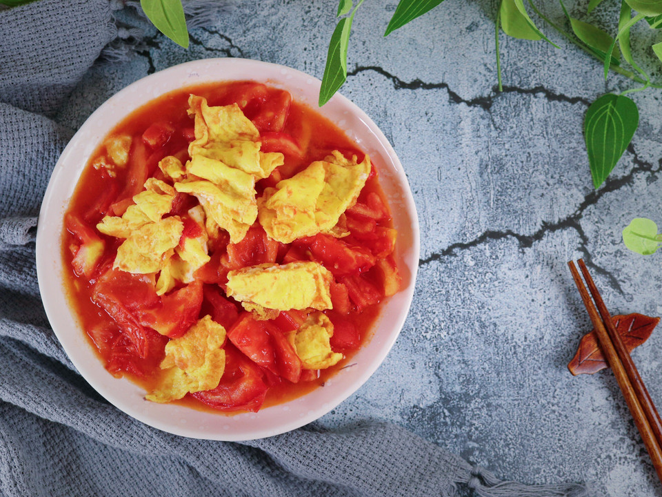

# 番茄炒蛋

## 📋 基本資訊 / Recipe Overview
- **料理名稱**：番茄炒蛋
- **原始標題**：番茄炒蛋
- **素食流派 / Diet**：蛋素 Ovo-Vegetarian
- **料理分類 / Category**：家常蔬食 / 經典熱菜
- **來源平台 / Source**：[豆果美食 · 素食專區](https://www.douguo.com/cookbook/2298919.html)

## 🌿 食材及佐料清單 / Ingredients
- 番茄 4个
- 鸡蛋 2个
- 盐 4克
- 鸡精 3克
- 食用油 8克

## 🍳 烹飪步驟 / Step-by-Step Cooking Steps
1. 番茄洗净待用
2. 番茄切小块
3. 准备鸡蛋
4. 鸡蛋打散
5. 热锅注油，把蛋液倒入锅中
6. 把蛋皮反过来也煎一下
7. 用锅铲把蛋皮割开
8. 取出鸡蛋，把番茄放入锅中翻炒
9. 把番茄煸炒出汁水
10. 放入鸡蛋翻炒
11. 加盐和鸡精，翻炒均匀出锅
12. 番茄鲜美
13. 鸡蛋软嫩
14. 出锅装盘
15. 成品图

## 💡 大廚美味秘訣 / Chef's Tips
- 加一些葱花会更香

---
*食譜歸檔時間：2026-08-21 · 來源：豆果美食 (www.douguo.com)*