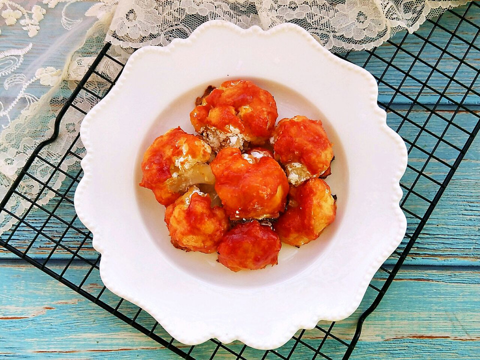

# 番茄菜花

## 📋 基本資訊 / Recipe Overview
- **料理名稱**：番茄菜花
- **原始標題**：番茄菜花
- **素食流派 / Diet**：蛋素 Ovo-Vegetarian
- **料理分類 / Category**：家常蔬食 / 經典熱菜
- **難易度 / Difficulty**：切墩(初级)
- **烹飪時間 / Cooking Time**：10~30分钟
- **來源平台 / Source**：[豆果美食 · 素食專區](https://www.douguo.com/cookbook/2333742.html)

## 📝 料理故事與簡介 / Story & Introduction
> 菜花又叫花椰菜，有白、绿两种，绿色的又叫西兰花、青花菜。菜花营养丰富，是《时代》杂志推荐的10大健康食品中第四名，菜花富含蛋白质、脂肪、碳水化合物、食物纤维、维生素及矿物质。其中维生素C含量较高，每100克中含维生素Cp85-100毫克，比大白菜高4倍，胡萝卜素含量是大白菜的8倍，维生素B2的含量是大白菜的2倍。 白、绿两种菜花营养、作用基本相同，绿色的较白色的胡萝卜素含量要高些。菜花肉质细嫩，味甘鲜美，食用后很容易消化吸收。古代西方人发现，常吃菜花有爽喉、开音、润肺、止咳的功效，因此他们把菜花叫做“天赐的良药”和“穷人的医生”。

## 🌿 食材及佐料清單 / Ingredients
- 菜花：半朵克
- 油：适量
- 盐：少许
- 蚝油：适量
- 孜然粉：适量
- 鸡蛋：2个
- 玉米淀粉：适量
- 番茄酱：适量

## 🍳 烹飪步驟 / Step-by-Step Cooking Steps
1. 白菜花冲洗干净切小朵，锅中烧水放盐，煮开放菜花焯至8成熟。
2. 焯熟的菜花沥干水份，加入蚝油盐，孜然粉，油。拌均匀。
3. 准备好鸡蛋液，玉米淀粉，番茄酱，取一个菜花粘上鸡蛋液。
4. 再加上一层玉米淀粉。
5. 但在粘上一层番茄酱。
6. 烤盘垫上油纸，摆上粘好番茄酱的菜花，送入预热好的烤箱中。
7. 烤箱调上下火170度，烤12分钟。
8. 外皮是酸甜的，里面有孜然的味道，口感丰富的烤菜花完成。

## 💡 大廚美味秘訣 / Chef's Tips
- 温度仅供参考，请根据自家烤箱调节温度。

---
*食譜歸檔時間：2026-08-20 · 來源：豆果美食 (www.douguo.com)*