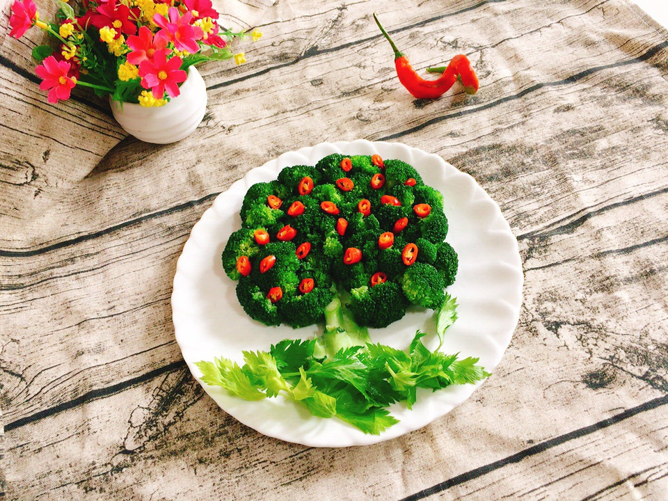

# 硕果累累

## 📋 基本資訊 / Recipe Overview
- **料理名稱**：硕果累累
- **原始標題**：硕果累累
- **素食流派 / Diet**：全素 Vegan
- **料理分類 / Category**：家常蔬食 / 經典熱菜
- **來源平台 / Source**：[豆果美食 · 素食專區](https://www.douguo.com/cookbook/2356421.html)

## 🌿 食材及佐料清單 / Ingredients
- 西兰花 1朵
- 红尖椒 1个
- 盐 1勺
- 油 适量
- 芹菜叶 3片

## 🍳 烹飪步驟 / Step-by-Step Cooking Steps
1. 西兰花的梗三分之一处切开备用！
2. 西兰花用剪刀剪成小朵，放在淡盐水中浸泡10分钟捞出备用！
3. 红尖椒切成圈儿，芹菜叶洗净沥干水分备用！
4. 水烧开，加入一勺盐，适量的色拉油，放入西兰花焯烫2分钟！
5. 焯好水的西兰花捞出来迅速过凉水，捞出沥干水份备用！
6. 西兰花的梗摆在盘子正下方中间位置，西兰花围着梗，摆成树的形状！
7. 把红尖椒圈儿摆在西兰花上，装饰一下！
8. 芹菜叶摆在最下面即可！也可以用黄瓜片来代替芹菜叶摆盘！
9. 一棵栩栩如生，硕果累累的苹果树就做好啦！开吃！
10. 成品图

---
*食譜歸檔時間：2026-08-20 · 來源：豆果美食 (www.douguo.com)*