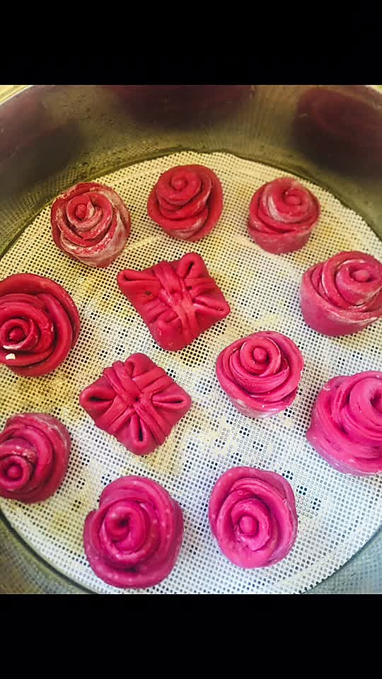

# 福袋豆沙包

## 📋 基本資訊 / Recipe Overview
- **料理名稱**：福袋豆沙包
- **原始標題**：福袋豆沙包
- **素食流派 / Diet**：蛋素 Ovo-Vegetarian
- **料理分類 / Category**：烘焙麵點 / 點心
- **難易度 / Difficulty**：切墩(初级)
- **烹飪時間 / Cooking Time**：30~60分钟
- **來源平台 / Source**：[豆果美食 · 素食專區](https://www.douguo.com/cookbook/3067557.html)

## 📝 料理故事與簡介 / Story & Introduction
> 顾名思义，福袋，新一年祝各位厨友福气满满，财气满袋，运气满袋，代代平安

## 🌿 食材及佐料清單 / Ingredients
- 红色面团部分
- 水
- 酵母
- 糖
- 面粉
- 甜菜根汁
- 鸡蛋
- 自制红豆沙馅

## 🍳 烹飪步驟 / Step-by-Step Cooking Steps
1. 甜菜根削皮，切小块
2. 用料理机榨出鲜红的汁
3. 加入酵母粉搅拌一下，再放入面粉、砂糖和一个鸡蛋
4. 揉成光滑的面团
5. 发酵成2倍大
6. 拿出面团排气
7. 福袋做法看如上视频，还做了几朵玫瑰花
8. 高温蒸出来颜色变了，不过还是挺好看的
9. 把甜菜根榨出来的渣也放点面粉做成刀切馒头，味道也不错

---
*食譜歸檔時間：2026-08-20 · 來源：豆果美食 (www.douguo.com)*