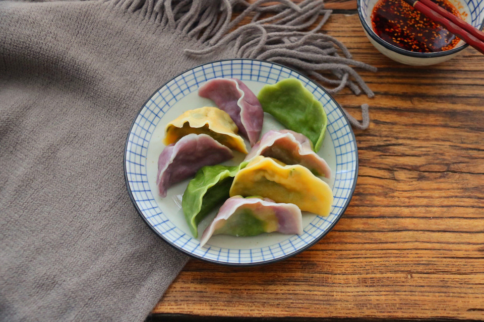

# 秋季养生菠菜鸡蛋素饺子

## 📋 基本資訊 / Recipe Overview
- **料理名稱**：秋季养生菠菜鸡蛋素饺子
- **原始標題**：秋季养生菠菜鸡蛋素饺子
- **素食流派 / Diet**：蛋素 Ovo-Vegetarian
- **料理分類 / Category**：家常蔬食 / 經典熱菜
- **來源平台 / Source**：[豆果美食 · 素食專區](https://www.douguo.com/cookbook/2357112.html)

## 🌿 食材及佐料清單 / Ingredients
- #馅料#：菠菜 320克
- 鸡蛋 3个
- 粉丝 40克
- 干木耳 8克
- 葱末、姜末 少许
- 胡椒粉。食盐、芝麻油 少许
- 生抽 2勺
- 蚝油 1勺
- #白色面团#：水 82克
- 普通面粉 160克
- #黄色面团#：热水 78克
- 南瓜粉 7克
- 普通面粉 150克
- #紫色面团#：热水 78克
- 紫薯粉 5克
- 普通面粉 150克
- #绿色面团#：热水 78克
- 青汁粉 4克
- 普通面粉 150克

## 🍳 烹飪步驟 / Step-by-Step Cooking Steps
1. 新鲜的菠菜摘去黄叶，去掉老根，放入盆里清洗干净。
2. 新鲜的菠菜摘去黄叶，去掉老根，放入盆里清洗干净。
3. 新鲜的菠菜摘去黄叶，去掉老根，放入盆里清洗干净。
4. 处理菠菜的同时，我们把面团揉好，青汁果蔬粉加入热水搅匀，每个颜色揉完，都用热水搅匀和下一个面团。果蔬粉也可以直接和面粉混合一起揉面，但是容易不均匀，先用热水融化后更方便。
5. 分别把每个颜色果蔬粉和面粉一起放入面包机桶，启动面包机和面，约8分钟揉好一个面团。
6. 辅料：大葱切碎，生姜切成末备用。
7. 揉好的面团，分别滚圆，加盖保鲜膜放置，我们来调饺子馅。
8. 菠菜碎、鸡蛋碎、木耳碎、粉丝碎，加入生姜末、葱末，放入盆里。倒入生抽2勺，蚝油1勺，胡椒粉少许，盐少许，用筷子拌匀。
9. 最后淋上少许芝麻油，拌匀，饺子馅就做好了。
10. 把面团从中间切开，取其中一半，分别搓成长条。
11. 把面团从中间切开，取其中一半，分别搓成长条。
12. 把面团从中间切开，取其中一半，分别搓成长条。
13. 把小剂子撒上一层面粉防粘，用手掌按成圆饼。
14. 用面杖擀成圆形饺子皮，舀一勺饺子馅放在中间，用手把上下两片饺子皮，捏紧，包成饺子。
15. 把包好的饺子放在面板上，颜色是不是很美啊。
16. 燃气开火，大火上锅，烧开水，下入饺子。
17. 煮沸后，加入冷水，连续两次煮沸后，饺子浮起，就熟了。
18. 盛入盘里，鲜香味美，喜欢辣的，可以蘸取油辣子，好开胃。
19. 咬一口，鲜香美味。
20. 成品图。

---
*食譜歸檔時間：2026-08-21 · 來源：豆果美食 (www.douguo.com)*