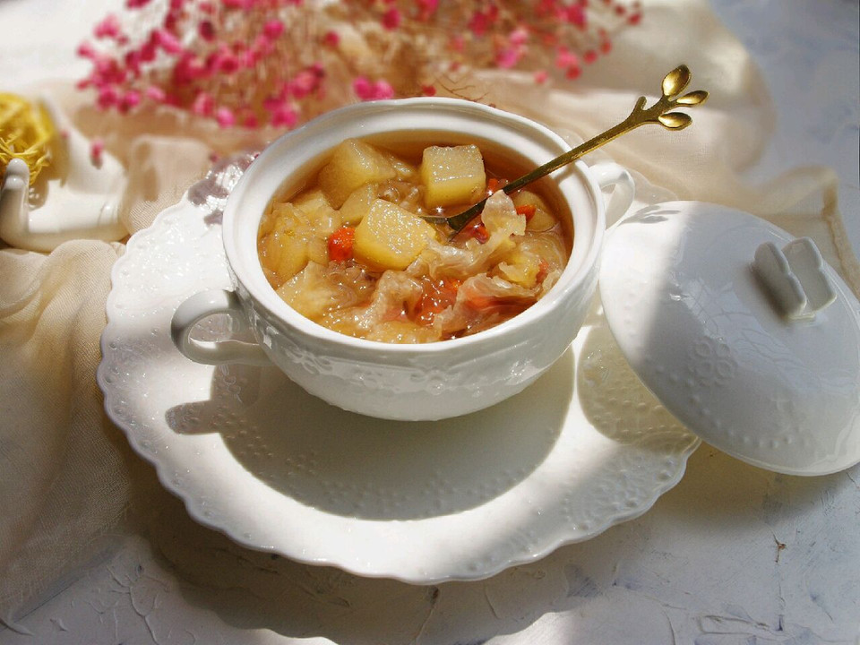

# 秋燥，来碗雪梨银耳羹吧！

## 📋 基本資訊 / Recipe Overview
- **料理名稱**：秋燥，来碗雪梨银耳羹吧！
- **原始標題**：秋燥，来碗雪梨银耳羹吧！
- **素食流派 / Diet**：全素 Vegan
- **料理分類 / Category**：湯品羹湯
- **來源平台 / Source**：[豆果美食 · 素食專區](https://www.douguo.com/cookbook/2333778.html)

## 🌿 食材及佐料清單 / Ingredients
- 雪梨 2个
- 银耳 8克左右
- 冰糖（或者碱蜂糖） 60克
- 枸杞 适量

## 🍳 烹飪步驟 / Step-by-Step Cooking Steps
1. 干银耳取8克左右。
2. 洗一下，用水泡半小时，银耳会变成一大碗。
3. 雪梨两个，去皮，切成小块。
4. 把银耳和雪梨放入锅中，砂锅最好噢，我比较懒，没去找砂锅，就直接用不锈钢小锅了。放入1200克左右的水。
5. 放入60克左右的冰糖，我家里正好有碱蜂糖，就放进去了，开火，水开后改小火，慢慢的炖。注意看着锅，不要溢锅。
6. 煮到水量明显变少，加入一些枸杞进去，汤汁与雪梨平齐时就可以关火了。整个过程大约40-50分钟左右就可以了！
7. 秋天里，一碗雪梨银耳羹做下午茶，没有在比这适合的了！因为加入了玫瑰碱蜂糖，所以我的这碗颜色偏红些，冰糖炖的要白一些。

## 💡 大廚美味秘訣 / Chef's Tips
- 冰糖量可随个人喜好添加。

---
*食譜歸檔時間：2026-08-21 · 來源：豆果美食 (www.douguo.com)*