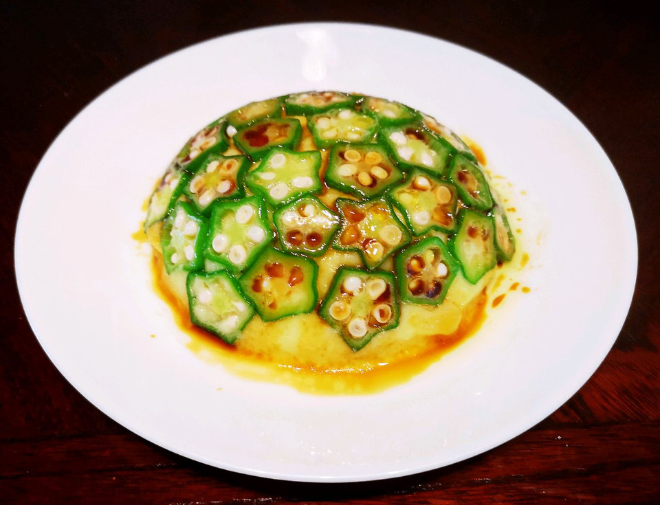

# 秋葵土豆泥

## 📋 基本資訊 / Recipe Overview
- **料理名稱**：秋葵土豆泥
- **原始標題**：秋葵土豆泥
- **素食流派 / Diet**：全素 Vegan
- **料理分類 / Category**：家常蔬食 / 經典熱菜
- **來源平台 / Source**：[豆果美食 · 素食專區](https://www.douguo.com/cookbook/3118055.html)

## 🌿 食材及佐料清單 / Ingredients
- 土豆 2个
- 秋葵 2个
- 盐 适量
- 生抽 适量
- 橄榄油

## 🍳 烹飪步驟 / Step-by-Step Cooking Steps
1. 蒸软，搅拌机打碎
2. 糊糊状，可放少许盐
3. 秋葵炒水，碗里刷油，摆好
4. 土豆泥倒入碗中
5. 倒扣在盘子上
6. 成型。
7. 淋上生抽，橄榄油即可。

## 💡 大廚美味秘訣 / Chef's Tips
- 碗里先刷油，再放秋葵。

---
*食譜歸檔時間：2026-08-21 · 來源：豆果美食 (www.douguo.com)*