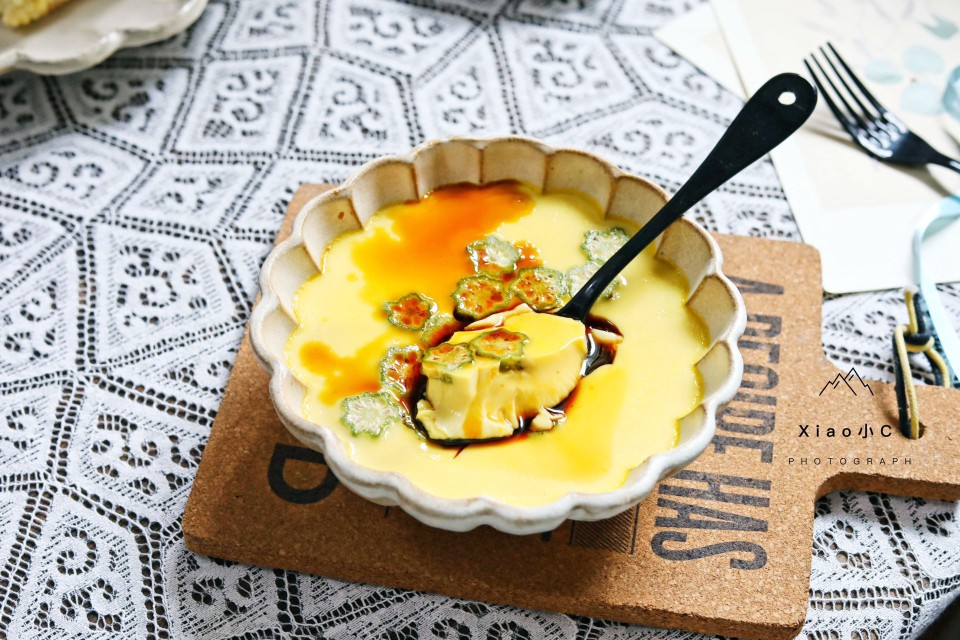

# 秋葵蒸蛋

## 📋 基本資訊 / Recipe Overview
- **料理名稱**：秋葵蒸蛋
- **原始標題**：秋葵蒸蛋
- **素食流派 / Diet**：蛋素 Ovo-Vegetarian
- **料理分類 / Category**：家常蔬食 / 經典熱菜
- **來源平台 / Source**：[豆果美食 · 素食專區](https://www.douguo.com/cookbook/2349697.html)

## 🌿 食材及佐料清單 / Ingredients
- 鸡蛋 3个
- 秋葵 1
- 水 适量
- 生抽 1勺

## 🍳 烹飪步驟 / Step-by-Step Cooking Steps
1. 鸡蛋打散。
2. 边加入水，边搅动混合均匀。
3. 边加入水，边搅动混合均匀。
4. 混合均匀的鸡蛋液过滤一遍。
5. 秋葵切片。
6. 将秋葵放在鸡蛋羹上。继续封上一层保鲜膜，蒸3分钟。
7. 成品图。
8. 成品图。
9. 成品图。

## 💡 大廚美味秘訣 / Chef's Tips
- 小贴士:
如何蒸出完美鸡蛋羹，几个小技巧掌握了，你就可以做出口感嫩滑的鸡蛋羹。
1、鸡蛋和水的比例是1:2。边加入水边搅动混合均匀。
2、混合好的鸡蛋液过滤一遍，搅动混合均匀的鸡蛋液会出现很多泡沫，这样避免蒸出来的鸡蛋羹出现许多蜂窝孔。
3、蒸鸡蛋的时候，包上一层保鲜膜，并在保鲜膜上叉几个小孔。

---
*食譜歸檔時間：2026-08-21 · 來源：豆果美食 (www.douguo.com)*