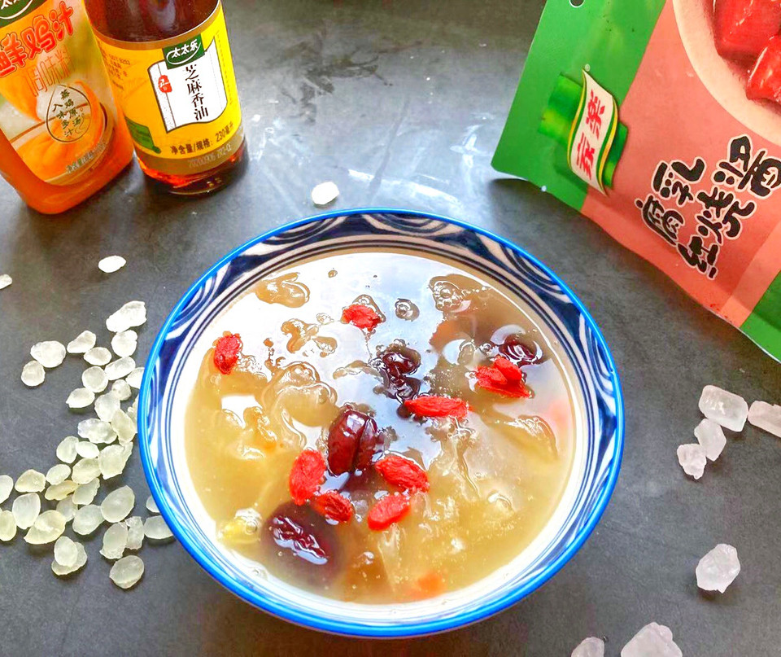

# 简单快手桃胶皂角米雪燕银耳羹

## 📋 基本資訊 / Recipe Overview
- **料理名稱**：简单快手桃胶皂角米雪燕银耳羹
- **原始標題**：简单快手桃胶皂角米雪燕银耳羹
- **素食流派 / Diet**：全素 Vegan
- **料理分類 / Category**：米食料理
- **來源平台 / Source**：[豆果美食 · 素食專區](https://www.douguo.com/cookbook/3045325.html)

## 🌿 食材及佐料清單 / Ingredients
- 皂角米 2把
- 桃胶 2把
- 银耳 1朵
- 红枣 几颗颗
- 枸杞 适量
- 雪燕 1把

## 🍳 烹飪步驟 / Step-by-Step Cooking Steps
1. 除了纯净水和冰糖，枸杞之外食材里所有的食材都称好，分别放入碗中倒入适量水浸泡12小时，把桃胶，雪燕和皂角米，红枣泡发开备用。
2. 浸泡好的桃胶，雪燕和皂角米，红枣分别用冷水把里头的杂质清洗掉。
3. 提前用电子称好5克冰糖放入碗中备用。
4. 锅内倒入2000毫升的清水，把洗好的桃胶和皂角米，红枣放入锅内，大火煮开后用勺子把浮在表面的白色浮沫用勺子撇干净，转小火炖煮半个小时。
5. 放入提前准备好的冰糖和浸泡好的雪燕，枸杞倒入锅内，盖上锅盖煮10分钟即可。

## 💡 大廚美味秘訣 / Chef's Tips
- 1:喜欢银耳，可以在泡桃胶皂角米和雪燕的时候把银耳泡发好后再倒入雪燕的时候一起放入锅内煮个十分钟。

2:浸泡和清洗桃胶皂角米和雪燕要用冷水浸泡和清洗，因为桃胶遇热会融化。

3:桃胶不要浸泡时间太长，否则也会融化。

---
*食譜歸檔時間：2026-08-21 · 來源：豆果美食 (www.douguo.com)*