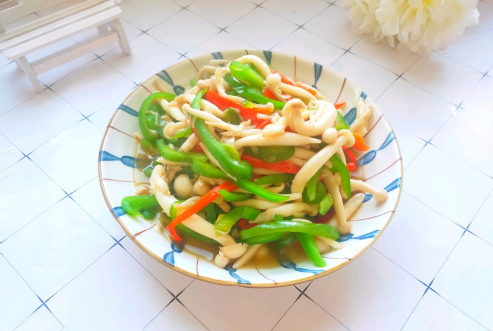

# 简单快手素炒蟹黄菇

## 📋 基本資訊 / Recipe Overview
- **料理名稱**：简单快手素炒蟹黄菇
- **原始標題**：简单快手素炒蟹黄菇
- **素食流派 / Diet**：全素 Vegan
- **料理分類 / Category**：家常蔬食 / 經典熱菜
- **難易度 / Difficulty**：切墩(初级)
- **烹飪時間 / Cooking Time**：10分钟左右
- **來源平台 / Source**：[豆果美食 · 素食專區](https://www.douguo.com/cookbook/2382187.html)

## 📝 料理故事與簡介 / Story & Introduction
> 前几天买了点蟹黄菇没吃，今天打算拿来做个小白也能轻松搞定的素炒蟹黄菇。

## 🌿 食材及佐料清單 / Ingredients
- 蟹黄菇：1盘
- 青椒：1个
- 红椒：1个
- 盐：1～2匙
- 葱末：适量
- 蚝油：1勺
- 白胡椒粉：适量

## 🍳 烹飪步驟 / Step-by-Step Cooking Steps
1. 所有食材准备好，买回来的蟹黄菇和青红椒放在盆中清洗干备用。
2. 洗好的青红椒分别切丝，锅内倒入适量水烧开，放入洗好的蟹黄菇焯水1分钟捞出备用。
3. 葱洗净切葱末备用。
4. 碗中倒入少量玉米淀粉，倒入少量的水用筷子搅拌成水淀粉备用。
5. 锅内倒入适量油烧热，倒入切好的葱末爆出香味。
6. 倒入焯好的蟹黄菇翻炒均匀后倒入切好青红椒丝翻炒均匀。
7. 倒入1勺蚝油和1～2匙食用盐和适量的白胡椒粉翻炒1～2分钟后倒入搅拌好的水淀粉勾一个薄芡关火盛出即可。

## 💡 大廚美味秘訣 / Chef's Tips
- 1：蟹黄菇焯水是为了在炒的时后节约时间。

2：不喜欢葱末的可以不放。

---
*食譜歸檔時間：2026-08-20 · 來源：豆果美食 (www.douguo.com)*