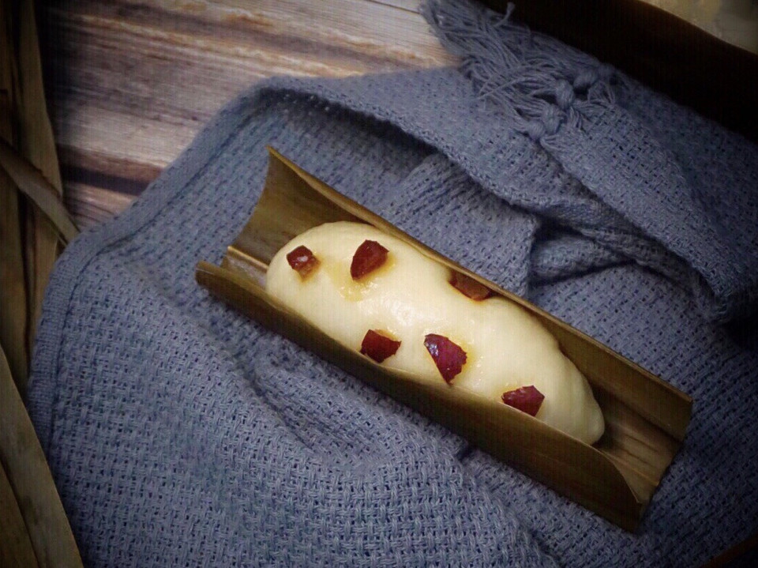

# 粽香米馒头

## 📋 基本資訊 / Recipe Overview
- **料理名稱**：粽香米馒头
- **原始標題**：粽香米馒头
- **素食流派 / Diet**：全素 Vegan
- **料理分類 / Category**：米食料理
- **來源平台 / Source**：[豆果美食 · 素食專區](https://www.douguo.com/cookbook/2309590.html)

## 🌿 食材及佐料清單 / Ingredients
- 中筋面粉 200g
- 粽叶（已泡好） 若干
- 粘米粉 60g
- 水（冬天温水） 135g
- 白糖 30g
- 耐高糖干酵母 3g
- 泡打粉 3g
- 粽叶（已泡好） 若干

## 🍳 烹飪步驟 / Step-by-Step Cooking Steps
1. 除粽叶外所有材料揉成光滑面团
2. 分成7等份面团，揉搓成长条，放在粽叶上，撒点红枣
室温35-40度左右，醒发20分钟
3. 水开上锅，大火蒸10分钟
4. 麦香、米香、粽香全在一锅里了～特别香～

## 💡 大廚美味秘訣 / Chef's Tips
- 粽叶有两面，毛面朝上光滑面朝下放入蒸笼内

---
*食譜歸檔時間：2026-08-21 · 來源：豆果美食 (www.douguo.com)*