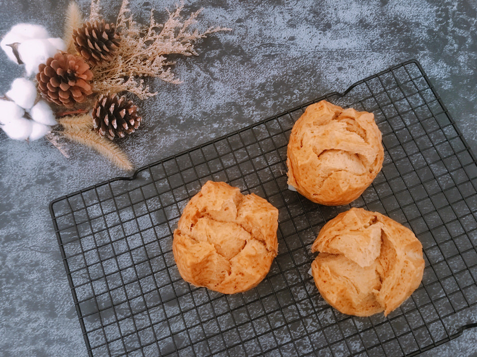

# 红糖开花馒头

## 📋 基本資訊 / Recipe Overview
- **料理名稱**：红糖开花馒头
- **原始標題**：红糖开花馒头
- **素食流派 / Diet**：全素 Vegan
- **料理分類 / Category**：烘焙麵點 / 點心
- **來源平台 / Source**：[豆果美食 · 素食專區](https://www.douguo.com/cookbook/2299486.html)

## 🌿 食材及佐料清單 / Ingredients
- 中筋粉 250克
- 水 150克
- 红糖 70克
- 酵母 4克
- 燕麦 30克

## 🍳 烹飪步驟 / Step-by-Step Cooking Steps
1. 准备好所需的食材
2. 红糖加水，小火融化
3. 煮开后关火
4. 加入燕麦搅拌均匀
5. 红糖燕麦加入到面粉中，放酵母和剩下的水，一起放入面包机，启动揉面程序
6. 翻滚吧，小面团
7. 揉好后放入盆中发酵至两倍大
8. 分割后滚圆
9. 用刀子在顶部刮十字，醒发20分钟
10. 蒸锅烧开后放入馒头，大火15分钟，后关火焖10分钟
11. 出锅啦
12. 开动吧

## 💡 大廚美味秘訣 / Chef's Tips
- 红糖燕麦糊糊放入面粉中揉面的时候需要降温，避免烫坏酵母

---
*食譜歸檔時間：2026-08-21 · 來源：豆果美食 (www.douguo.com)*