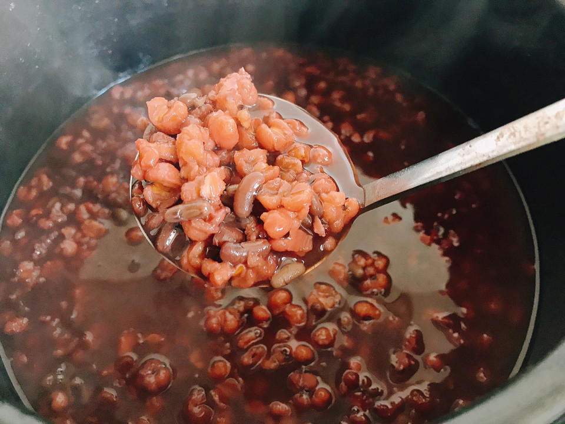

# 红豆薏米粥

## 📋 基本資訊 / Recipe Overview
- **料理名稱**：红豆薏米粥
- **原始標題**：红豆薏米粥
- **素食流派 / Diet**：全素 Vegan
- **料理分類 / Category**：米食料理
- **難易度 / Difficulty**：配菜(中级)
- **烹飪時間 / Cooking Time**：30~60分钟
- **來源平台 / Source**：[豆果美食 · 素食專區](https://www.douguo.com/cookbook/2501335.html)

## 📝 料理故事與簡介 / Story & Introduction
> 养生粥来喽～去体内湿气的红豆薏米粥，夏天喝特别好

## 🌿 食材及佐料清單 / Ingredients
- 薏米：1把
- 赤小豆：1把

## 🍳 烹飪步驟 / Step-by-Step Cooking Steps
1. 薏米提前浸泡一晚上
2. 记住要买赤小豆煮才有去湿气的功效，赤小豆也要泡一晚
3. 把薏米炒一下，因为薏米属于寒性食物，需要小火炒一下
4. 放入砂锅中煮熟，煮的时间先大火煮开，然后关火，焖十五分钟左右，再转小火慢慢煮，煮40分钟左右，薏米红豆粥就可以啦
5. 红豆薏米粥，是养生佳品
6. 老少都特别爱喝

## 💡 大廚美味秘訣 / Chef's Tips
- 注意⚠️红豆薏米粥里的红豆要选赤小豆

---
*食譜歸檔時間：2026-08-20 · 來源：豆果美食 (www.douguo.com)*