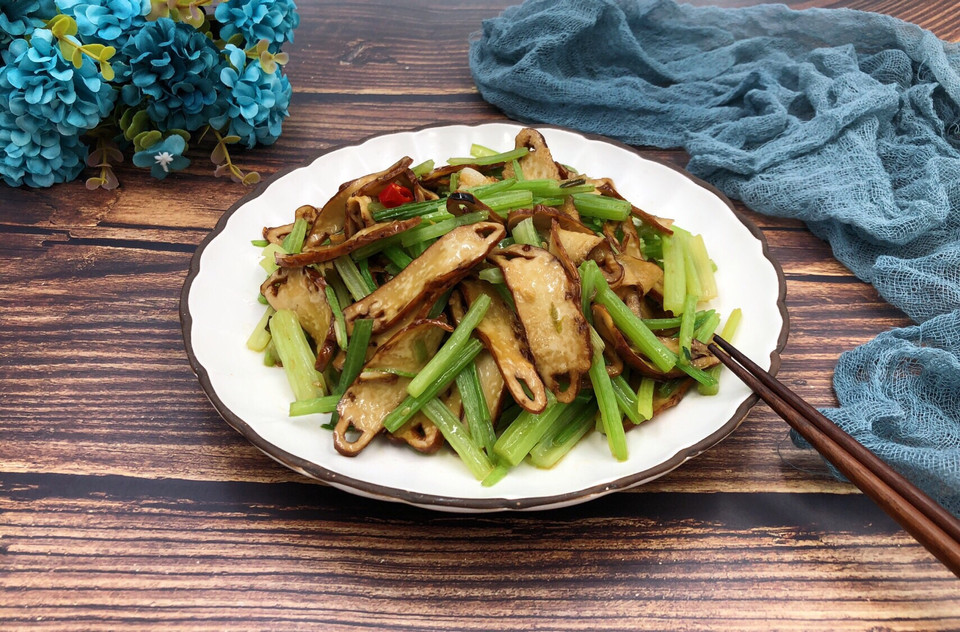

# 美味家常菜-芹菜炒香干

## 📋 基本資訊 / Recipe Overview
- **料理名稱**：美味家常菜-芹菜炒香干
- **原始標題**：美味家常菜-芹菜炒香干
- **素食流派 / Diet**：全素 Vegan
- **料理分類 / Category**：家常蔬食 / 經典熱菜
- **來源平台 / Source**：[豆果美食 · 素食專區](https://www.douguo.com/cookbook/2074599.html)

## 🌿 食材及佐料清單 / Ingredients
- 香芹 一小把
- 五香脆皮干 100g
- 小葱 一根
- 蒜瓣 两个
- 小米椒 一个
- 盐 少许
- 耗油 少许

## 🍳 烹飪步驟 / Step-by-Step Cooking Steps
1. 一小把香芹
2. 香芹摘好，切小段儿，洗干净备用
3. 香干切薄片（我选的是五香脆皮干）
4. 葱蒜辣椒切碎
5. 起锅热油
6. 葱蒜辣椒爆香
7. 倒入香干，翻炒均匀（香干是熟的，翻均匀即可）
8. 下入香芹，大火翻炒
9. 加入少量耗油
10. 炒至香芹变色即可，放少许盐调味，关火盛盘（香味飘飘的出来了，真是诱人，马上开吃）
11. 成品图，是不是很清新很美味
12. 成品图

## 💡 大廚美味秘訣 / Chef's Tips
- ♥︎这种香干有点硬，最好切薄片，薄一点口感比较好
♥︎香芹叶可以蒸着吃，我是这么吃的不浪费哦，也可以焯一下凉拌也不错

---
*食譜歸檔時間：2026-08-21 · 來源：豆果美食 (www.douguo.com)*