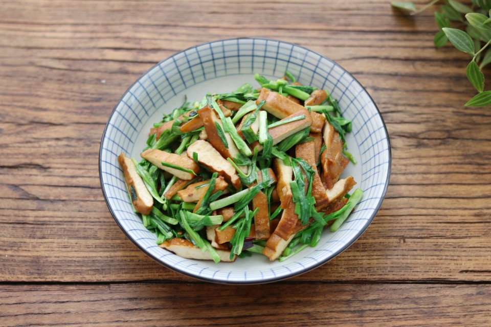

# 美味消食蒜苗炒豆干

## 📋 基本資訊 / Recipe Overview
- **料理名稱**：美味消食蒜苗炒豆干
- **原始標題**：美味消食蒜苗炒豆干
- **素食流派 / Diet**：全素 Vegan
- **料理分類 / Category**：家常蔬食 / 經典熱菜
- **來源平台 / Source**：[豆果美食 · 素食專區](https://www.douguo.com/cookbook/2389607.html)

## 🌿 食材及佐料清單 / Ingredients
- 蒜苗 180克
- 豆干 250克
- 盐 少许
- 植物油 适量
- 干辣椒 2个

## 🍳 烹飪步驟 / Step-by-Step Cooking Steps
1. 准备好所用的食材，蒜苗去黄叶洗净，豆干流水冲下沥干水分。蒜苗是我水培种植的，特别新鲜，发芽的大蒜头直接把根部，放入水中就可以长成蒜苗。
2. 把洗净沥干水的蒜苗切成小段，装盘备用。
3. 把沥干水的豆干，切成小条备用。
4. 炒锅放入适量植物油，烧至六七成热，放入干辣椒炸出香味。
5. 倒入豆干，翻炒拌匀，翻炒至豆干水分蒸发。倒入切好的蒜苗，快速翻拌20秒。
6. 加入少许食盐调味，关火拌匀。
7. 盛入盘里，即可享用美食。
8. 鲜香美味。
9. 你学会了吗？

## 💡 大廚美味秘訣 / Chef's Tips
- 1、蒜苗是大蒜的嫩叶，如果用市售的可以只用叶子来炒，老梗直接生吃。

2、豆干也叫豆腐干或者香干，有五香的，麻辣的，自己选择口味。

3、豆干都带有盐味，加盐的时候，可以尝尝咸淡，有盐就不用放了。

---
*食譜歸檔時間：2026-08-21 · 來源：豆果美食 (www.douguo.com)*