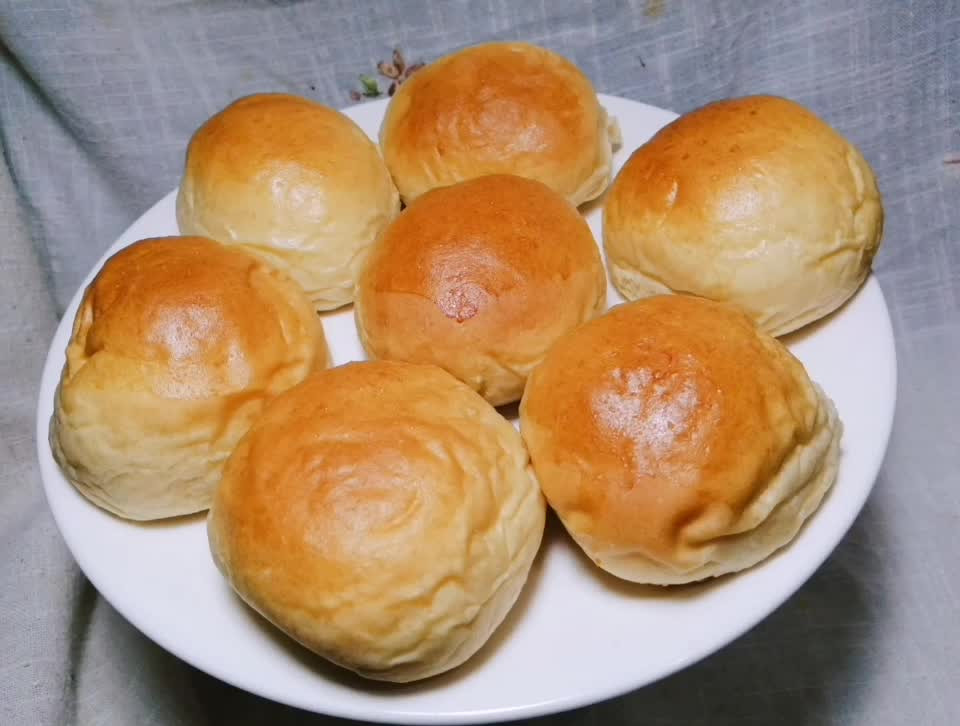

# 肉桂苹果馅小面包

## 📋 基本資訊 / Recipe Overview
- **料理名稱**：肉桂苹果馅小面包
- **原始標題**：肉桂苹果馅小面包
- **素食流派 / Diet**：奶素 Lacto-Vegetarian
- **料理分類 / Category**：烘焙麵點 / 點心
- **難易度 / Difficulty**：切墩(初级)
- **烹飪時間 / Cooking Time**：15-30 分鐘
- **來源平台 / Source**：[豆果美食 · 素食專區](https://www.douguo.com/cookbook/3100335.html)

## 📝 料理故事與簡介 / Story & Introduction
> 肉桂与苹果是非常绝妙的组合，香甜软糯的苹果馅让人回味无穷，肉桂苹果馅的制作步骤简单易上手。
苹果是一年四季水果，含有非常高的营养成分，而且果肉中含有多种维生素与矿物质，其中的钙成分也比较高，非常有助于我们人体的新陈代谢，经常吃苹果可以起到减肥减脂的效果促进肠道蠕动。

## 🌿 食材及佐料清單 / Ingredients
- 高筋面粉：200
- 细砂糖：20g
- 盐：2g
- 酵母：3g
- 水：115g
- 黄油：20g
- （内馅）
- 苹果：300g
- 黄油：10g
- 肉桂粉：1g
- 白糖：20g
- 淀粉：10g
- 柠檬汁：5g
- 盐：1g

## 🍳 烹飪步驟 / Step-by-Step Cooking Steps
1. 苹果去皮去核
2. 切丁
3. 不粘锅放入黄油融化
4. 放入苹果丁
5. 炒至变色加入肉桂粉，盐，白糖，翻炒均匀
6. 加入淀粉快速翻炒均匀
7. 炒至抱团即可
8. 面团所有材料放入厨师机揉好
9. 分剂9个（我做了2倍的量）
10. 面团擀开包入馅料
11. 收口
12. 室温发酵两倍大，表面涮蛋液
13. 烤箱预热，175度烤20分钟，表面上色及时盖锡纸
14. 出炉
15. 软腾腾的肉桂苹果小面包
16. 味道香甜

---
*食譜歸檔時間：2026-08-20 · 來源：豆果美食 (www.douguo.com)*