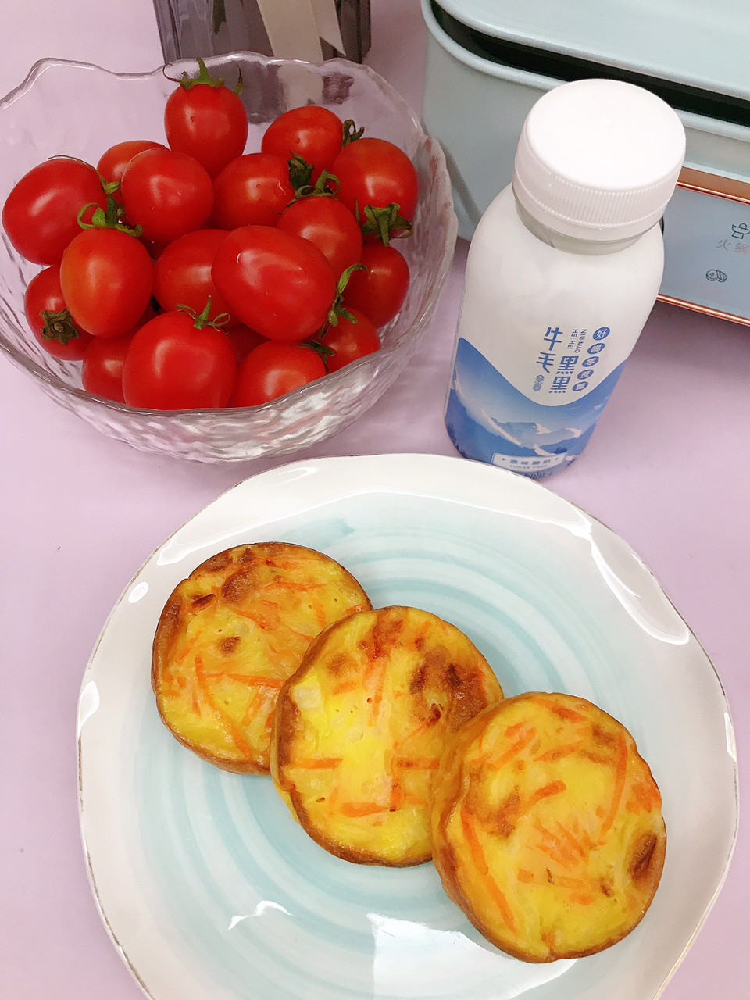

# 胡萝卜鸡蛋饼

## 📋 基本資訊 / Recipe Overview
- **料理名稱**：胡萝卜鸡蛋饼
- **原始標題**：胡萝卜鸡蛋饼
- **素食流派 / Diet**：蛋素 Ovo-Vegetarian
- **料理分類 / Category**：烘焙麵點 / 點心
- **難易度 / Difficulty**：切墩(初级)
- **烹飪時間 / Cooking Time**：10~30分钟
- **來源平台 / Source**：[豆果美食 · 素食專區](https://www.douguo.com/cookbook/3067602.html)

## 📝 料理故事與簡介 / Story & Introduction
> #早餐#胡萝卜鸡蛋饼➕酸奶➕圣女果

今天就用高颜值法格多功能锅来做一个胡萝卜鸡蛋饼，配上水果酸奶，能量满满的早餐就搞掂了。

## 🌿 食材及佐料清單 / Ingredients
- 胡萝卜：1条
- 大白菜：适量
- 鸡蛋：2个
- 面粉：4勺
- 盐：适量
- 酵母粉：少许
- 油：适量

## 🍳 烹飪步驟 / Step-by-Step Cooking Steps
1. 胡萝卜削皮后用切菜器切丝
2. 大白菜切丝
3. 放盐
4. 腌制10分钟
5. 加入鸡蛋
6. 搅拌均匀
7. 加入面粉
8. 搅拌均匀
9. 加入酵母粉搅拌均匀静置20分钟
10. 六圆盘上刷一层油
11. 静置好的面糊
12. 将面糊分别放入盘中
13. 盖上盖子，最低温度烤
14. 几分钟后的状态
15. 翻面继续烤
16. 烤至金黄。
17. 装盘
18. 配上水果和酸奶，元气满满的早餐就做好啦

## 💡 大廚美味秘訣 / Chef's Tips
- 用家用多功能料理锅的六圆盘做烙饼太可了，少油烟不糊底

---
*食譜歸檔時間：2026-08-20 · 來源：豆果美食 (www.douguo.com)*