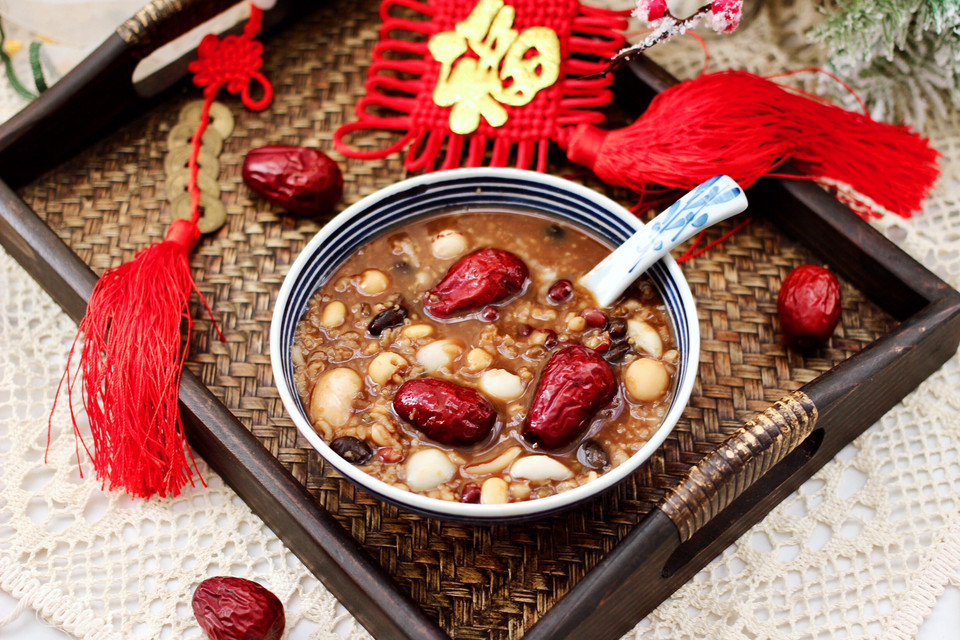

# 腊八节必喝的腊八粥

## 📋 基本資訊 / Recipe Overview
- **料理名稱**：腊八节必喝的腊八粥
- **原始標題**：腊八节必喝的腊八粥
- **素食流派 / Diet**：全素 Vegan
- **料理分類 / Category**：米食料理
- **難易度 / Difficulty**：切墩(初级)
- **烹飪時間 / Cooking Time**：1小时以上
- **來源平台 / Source**：[豆果美食 · 素食專區](https://www.douguo.com/cookbook/3054472.html)

## 📝 料理故事與簡介 / Story & Introduction
> 过了腊八就是年，今天腊八节是一定要煮腊八粥喝的，自己熬煮的粥口感香气扑鼻，软糯细滑超好喝，八宝粥食材与制作都很简单，成品色泽鲜艳又质软香甜，口感更是一级棒哟……

## 🌿 食材及佐料清單 / Ingredients
- 大米：50克
- 红豆：20克
- 黄豆：20克
- 黑豆：20克
- 绿豆：20克
- 大枣：6个
- 鹰嘴豆：20克
- 大芸豆：10颗
- 糯米：30克
- 百合：20克
- 芡实：20克
- 麦仁：50克
- 莲子：20克
- 冰糖：30克

## 🍳 烹飪步驟 / Step-by-Step Cooking Steps
1. 首先备齐所有的食材。
2. 把豆类放在一起浸泡4小时。
3. 红枣浸泡半小时。
4. 把米类和百合也浸泡半小时。
5. 砂锅里倒入适量的清水，先放入浸泡好的豆类。
6. 大火煮沸后转小火熬煮半小时。
7. 加入所有浸泡好的米类和百合。
8. 加入浸泡好的红枣。
9. 继续中火煮沸后，转小火炖煮至米汤汁变得越来越浓稠时。
10. 这个时候加入冰糖。
11. 中火煮沸后，继续小火慢慢炖煮。
12. 看见冰糖慢慢全部融化，汤汁变得粘稠时，即可关火。
13. 好喝又营养的八宝红糖粥出锅咯，盛到碗里即可享用了。
14. 喝上一碗暖心暖胃驱寒又营养，喜欢的小伙伴们赶紧试试吧～

## 💡 大廚美味秘訣 / Chef's Tips
- 1、所有的豆类都要提前洗净后浸泡至少4个小时左右、这样做出来的粥、营养才会彻底释放出来、熬出来的粥才会好喝哟……
2、一定要按照菜谱步骤来操作哟、因为食材受热度不一样、切记切记哟……

---
*食譜歸檔時間：2026-08-20 · 來源：豆果美食 (www.douguo.com)*