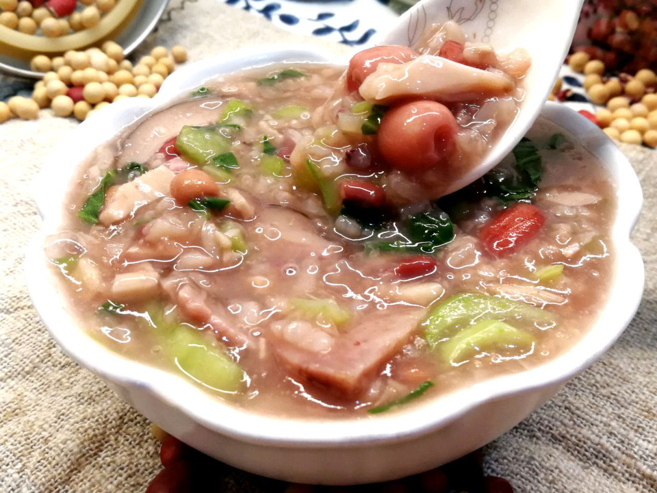

# 腊八节快到了来碗腊八粥吧

## 📋 基本資訊 / Recipe Overview
- **料理名稱**：腊八节快到了来碗腊八粥吧
- **原始標題**：腊八节快到了来碗腊八粥吧
- **素食流派 / Diet**：全素 Vegan
- **料理分類 / Category**：米食料理
- **來源平台 / Source**：[豆果美食 · 素食專區](https://www.douguo.com/cookbook/3053430.html)

## 🌿 食材及佐料清單 / Ingredients
- 黄豆 15克
- 花生米 15克
- 红豆 15克
- 莲子 适量
- 糯米 25克
- 大米 25克
- 青菜 3棵
- 茨菇 3个
- 马蹄 3个
- 冬笋 1个
- 核桃仁 6瓣
- 莲子 15粒
- 金龙鱼橄榄油 1勺

## 🍳 烹飪步驟 / Step-by-Step Cooking Steps
1. 准备好食材
2. 处理干净
3. 米和豆子分别提前浸泡，洗净。
4. 先把豆子放入锅煮七成熟
5. 除了青菜外，把其它食材放入，加适量水。
6. 煮20分钟后，边搅拌边煮10分钟。
7. 倒入青菜，加盐和鸡精，煮出青菜香味，加入1勺金龙鱼橄榄油。
8. 香喷喷，热气腾腾
9. 上桌啦
10. 开吃。

## 💡 大廚美味秘訣 / Chef's Tips
- 吴妈小贴士：煮粥要开水下锅，冷水煮粥容易糊底，开水下锅就不会有此现象，并且他比冷水煮粥更省时间。

---
*食譜歸檔時間：2026-08-21 · 來源：豆果美食 (www.douguo.com)*