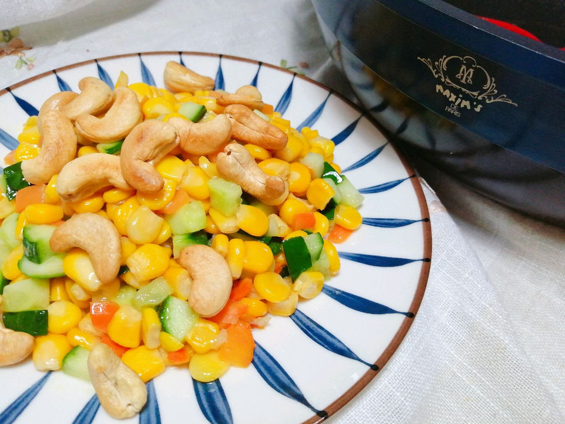

# 腰果玉米粒

## 📋 基本資訊 / Recipe Overview
- **料理名稱**：腰果玉米粒
- **原始標題**：腰果玉米粒
- **素食流派 / Diet**：全素 Vegan
- **料理分類 / Category**：米食料理
- **難易度 / Difficulty**：切墩(初级)
- **烹飪時間 / Cooking Time**：15-30 分鐘
- **來源平台 / Source**：[豆果美食 · 素食專區](https://www.douguo.com/cookbook/3062339.html)

## 🌿 食材及佐料清單 / Ingredients
- 甜玉米粒：350克
- 胡萝卜：100克
- 黄瓜：100克
- 盐：2克
- 腰果：适量
- 葱花：20g
- 食用油：20g

## 🍳 烹飪步驟 / Step-by-Step Cooking Steps
1. 原料
2. 炒锅入花生油，葱花、胡萝卜炒香
3. 放入玉米粒、黄瓜丁，加入盐，炒匀
4. 出锅，放上腰果

## 💡 大廚美味秘訣 / Chef's Tips
- 简单快手的一道菜，大人小朋友都很喜欢

---
*食譜歸檔時間：2026-08-20 · 來源：豆果美食 (www.douguo.com)*