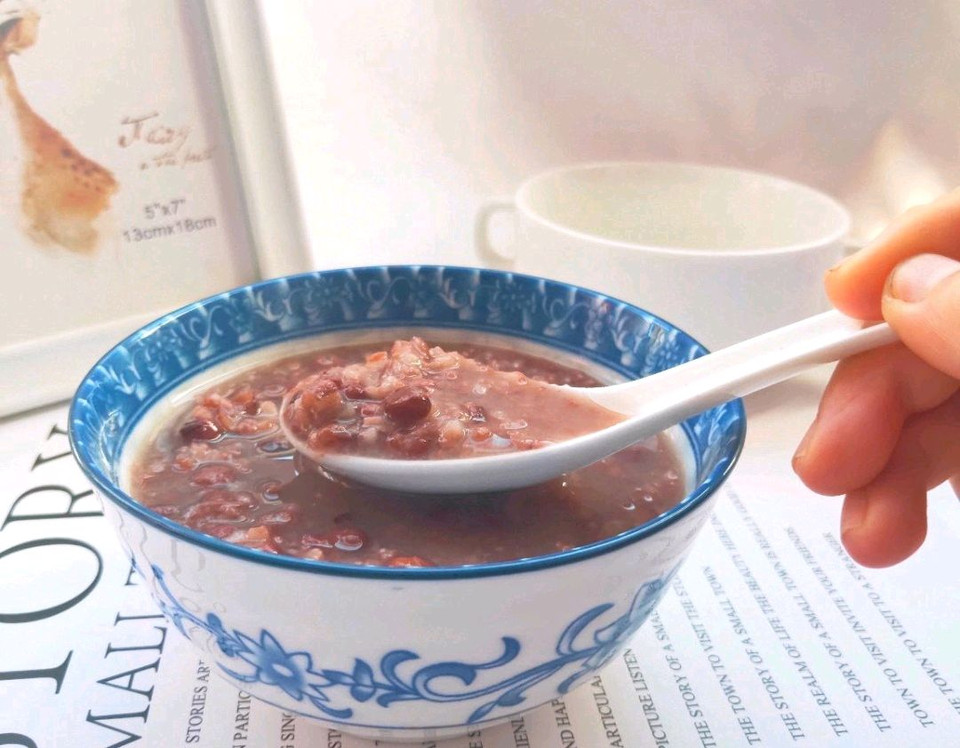

# 自制健康营养腊八粥

## 📋 基本資訊 / Recipe Overview
- **料理名稱**：自制健康营养腊八粥
- **原始標題**：自制健康营养腊八粥
- **素食流派 / Diet**：全素 Vegan
- **料理分類 / Category**：米食料理
- **來源平台 / Source**：[豆果美食 · 素食專區](https://www.douguo.com/cookbook/2392042.html)

## 🌿 食材及佐料清單 / Ingredients
- 红豆 1把
- 豌豆 1把
- 绿豆 1把
- 大米 1把
- 紫米 1把
- 花生米 1把
- 红枣 1把
- 扁豆种子 1把

## 🍳 烹飪步驟 / Step-by-Step Cooking Steps
1. 所有食材除了大米和紫米红枣外其他食材放在碗中倒入适量水浸泡一夜。
2. 浸泡好的食材清洗干净，放入电饭煲内倒入适量水摁一下电饭煲快煮键煮开后转保温键焖15～20分钟。
3. 大米紫米和大枣分别清洗好干净备用。
4. 清洗干净的大米紫米和大枣分别倒入焖好的粥内倒入适量水再次摁快煮键盘煮开后再次转到保温键焖15～20分钟。
5. 焖好的粥再次倒入适量水再次摁倒快煮键煮开关火盛出即可。

## 💡 大廚美味秘訣 / Chef's Tips
- 1：食材可以根据自己喜欢随意搭配，或者从超市买搭配好的食材回来自己煮。

2：喜欢吃甜的可以在煮粥的时候加入几块的冰糖进去。

3：焖煮和加凉水是为了粥快速的煮烂。

---
*食譜歸檔時間：2026-08-21 · 來源：豆果美食 (www.douguo.com)*