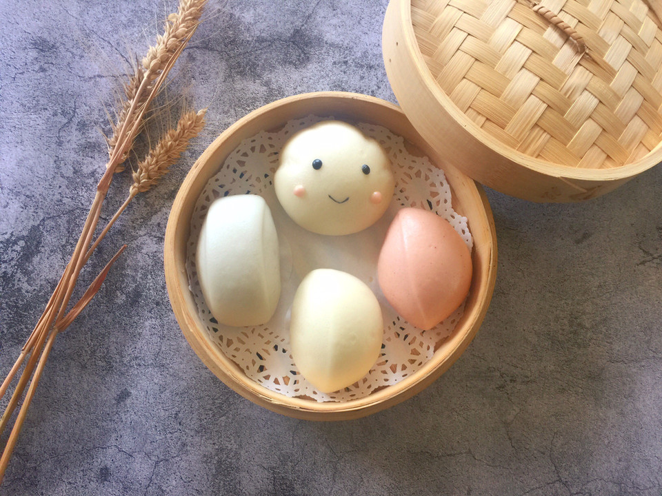

# 花样馒头

## 📋 基本資訊 / Recipe Overview
- **料理名稱**：花样馒头
- **原始標題**：花样馒头
- **素食流派 / Diet**：全素 Vegan
- **料理分類 / Category**：烘焙麵點 / 點心
- **來源平台 / Source**：[豆果美食 · 素食專區](https://www.douguo.com/cookbook/2303517.html)

## 🌿 食材及佐料清單 / Ingredients
- 白面团 200克
- 酵母 1.5克
- 温水 100克
- 白糖 10克
- 红面团 100克
- 红曲粉 一点
- 白糖 6-8克
- 酵母 1克
- 温水 50克
- 蓝面团 100克
- 蝶豆花水 50克
- 白糖 6-8克
- 酵母 1克

## 🍳 烹飪步驟 / Step-by-Step Cooking Steps
1. 蝶豆花提前用热水泡开
2. 分别揉成光滑的面团
3. 白面团分成50克的剂子滚圆
4. 用勺子把在上面压出白云的线条
5. 压四道线，稍微按扁一点
6. 红色面团揉切成长条，用刀切成自己想要的大小
7. 揉好的面团切开后很细腻
8. 蓝色面团同上
9. 把白云做上表情，也可以蒸熟后用食用色素笔画上
10. 锅中添入适量的清水放馒头醒发30-40分钟左右，看状态用手轻按会缓慢回弹
11. 大火烧开转中火20-25分钟即可，焖3-5分钟左右开锅盖，揭锅盖时要快别把馏水滴到馒头上。

---
*食譜歸檔時間：2026-08-21 · 來源：豆果美食 (www.douguo.com)*