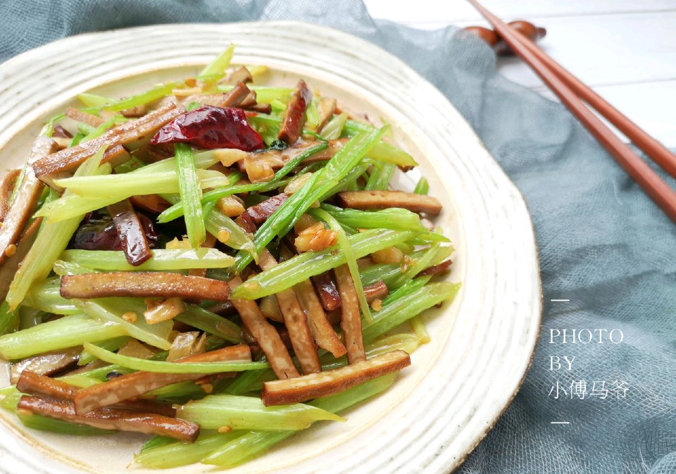

# 芹菜炒香干

## 📋 基本資訊 / Recipe Overview
- **料理名稱**：芹菜炒香干
- **原始標題**：芹菜炒香干
- **素食流派 / Diet**：全素 Vegan
- **料理分類 / Category**：家常蔬食 / 經典熱菜
- **難易度 / Difficulty**：切墩(初级)
- **烹飪時間 / Cooking Time**：10~30分钟
- **來源平台 / Source**：[豆果美食 · 素食專區](https://www.douguo.com/cookbook/2307044.html)

## 📝 料理故事與簡介 / Story & Introduction
> 父亲节要到了，相比起送父母贵重的礼物和金钱，陪在他们身边，给他们做一道可口的饭菜，对他们来说更为幸福。
这道芹菜炒香干，用的是普通的食材，但营养价值很高，芹菜清热解毒、利尿消肿、平肝降压，对高血压、高血糖人群来说十分有益，还具有润肠通便的作用，很适合做给老人吃。
在父亲节到来之际，赶紧学会它，给爸爸妈妈做起来吧~

## 🌿 食材及佐料清單 / Ingredients
- 芹菜：1把
- 香干：适量
- 蒜：2瓣
- 干辣椒（可不放）：4个
- 盐：少许
- 耗油：1大勺
- 一品鲜酱油：1大勺
- 清水：适量

## 🍳 烹飪步驟 / Step-by-Step Cooking Steps
1. 芹菜洗净，用这种细的小芹菜，图中的量我用了一半，一个人的量。
2. 大蒜切碎。
3. 香干切成条备用。
4. 芹菜斜着切成均匀的段，粗的部分用刀分成两半，更好入味。（这时候锅中烧开水，焯芹菜用）
5. 水开后把切好的芹菜放入，加入一滴食用油，颜色更翠绿焯1分钟捞出。
6. 另起锅倒入适量油，加入蒜和干辣椒中小火煸出香味。
7. 加入香干快速翻炒一下。
8. 加入芹菜，转中大火，快速翻炒一下，然后加入盐和剩下的调味料。
9. 翻炒均匀，芹菜均匀的上色即可，不需要太久。
10. 成品图。

## 💡 大廚美味秘訣 / Chef's Tips
- 芹菜斜着切，炒的时候更容易入味哦。
不喜欢辣的可以不放干辣椒。
美味的食物里总是藏着爱
感谢看到最后的你们。

---
*食譜歸檔時間：2026-08-20 · 來源：豆果美食 (www.douguo.com)*