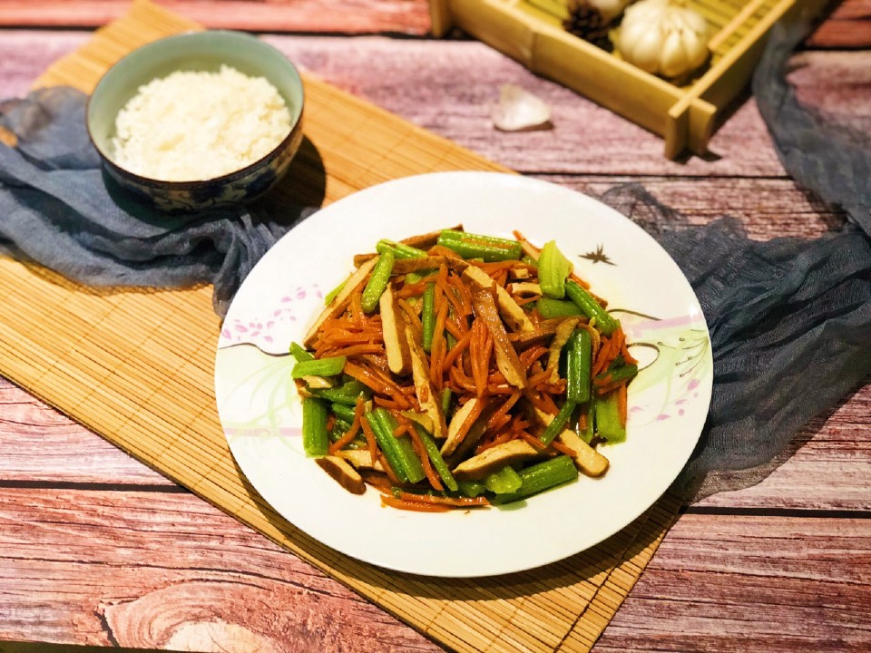

# 芹菜胡萝卜炒香干

## 📋 基本資訊 / Recipe Overview
- **料理名稱**：芹菜胡萝卜炒香干
- **原始標題**：素食——芹菜胡萝卜炒香干
- **素食流派 / Diet**：全素 Vegan
- **料理分類 / Category**：家常蔬食 / 經典熱菜
- **難易度 / Difficulty**：切墩(初级)
- **烹飪時間 / Cooking Time**：15-30 分鐘
- **來源平台 / Source**：[豆果美食 · 素食專區](https://www.douguo.com/cookbook/1721693.html)

## 🌿 食材及佐料清單 / Ingredients
- 芹菜：两小颗
- 胡萝卜：一根
- 香干：四片
- 蒜：两瓣
- 姜：两片
- 白胡椒：少量
- 盐：适量
- 蚝油：一小勺
- 香油：少量
- 鸡精：一勺

## 🍳 烹飪步驟 / Step-by-Step Cooking Steps
1. 芹菜切段，胡萝卜切丝，香干切丝，姜切丝，大蒜切碎备用。
2. 热锅凉油倒入姜蒜爆香再加入胡萝卜丝炒至变色
3. 加芹菜断生
4. 加香干翻炒均匀后加适量盐
5. 加入蚝油翻炒
6. 炒至九分熟后加入少量的白胡椒提味儿。
7. 出锅前放入一勺鸡精炒匀后淋入少许香油即可（淋入明油一是可以增加菜的香味，二是可以增强菜的色泽）。

---
*食譜歸檔時間：2026-08-20 · 來源：豆果美食 (www.douguo.com)*