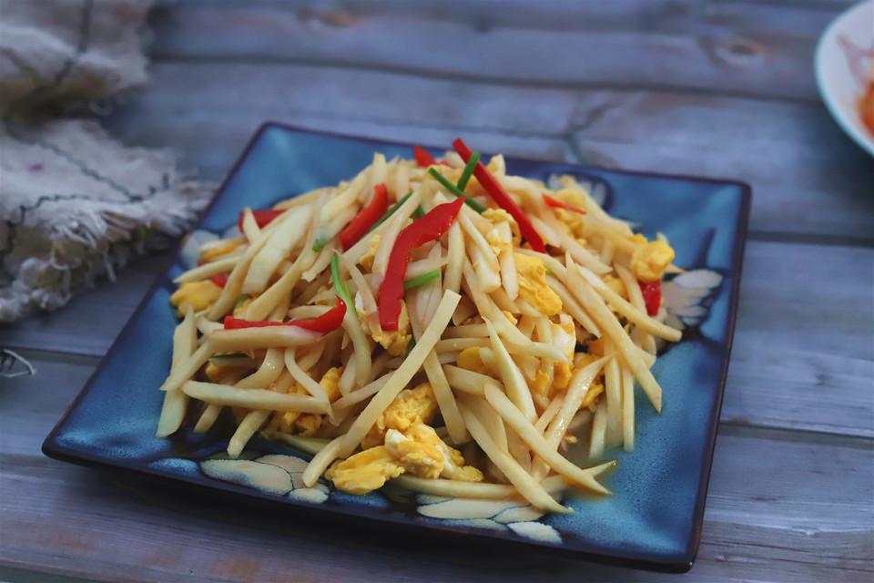

# 茭白炒鸡蛋

## 📋 基本資訊 / Recipe Overview
- **料理名稱**：茭白炒鸡蛋
- **原始標題**：茭白炒鸡蛋
- **素食流派 / Diet**：蛋素 Ovo-Vegetarian
- **料理分類 / Category**：家常蔬食 / 經典熱菜
- **來源平台 / Source**：[豆果美食 · 素食專區](https://www.douguo.com/cookbook/2356864.html)

## 🌿 食材及佐料清單 / Ingredients
- 茭白 几根
- 鸡蛋 三个
- 红辣椒 半个
- 小葱 两根

## 🍳 烹飪步驟 / Step-by-Step Cooking Steps
1. 新鲜的茭白摘去叶子去掉根部，清洗干净。
2. 将茭白先切成片，然后切成稍微粗点的丝。
3. 红辣椒半根，不要辣椒籽，切成丝，这种辣椒不辣，用来提色提香特别好。
4. 准备一根小葱，摘去老叶子，切成小段。
5. 鸡蛋三个，打入干净的容器中。
6. 往鸡蛋中加入一调羹水，普通的自来水就可以，用筷子搅拌均匀，这样做出来的炒鸡蛋口感蓬松又柔嫩。
7. 锅中加入适量的油烧热，然后倒入鸡蛋液，一边加热一边用筷子顺时针搅动，把鸡蛋搅拌成自然的蓬松碎块，鸡蛋成型就盛出来备用。
8. 锅中留底油，倒入茭白和红椒丝翻炒。
9. 加入蚝油，生抽，一点点料酒，料酒的量要少一些，多了会影响鸡蛋的鲜味。
10. 待茭白明显变软的时候就完全熟了，此时倒入刚才炒好的鸡蛋，放入小葱段，翻炒均匀。
11. 最后加少许盐和鸡精调味即可装盘。

---
*食譜歸檔時間：2026-08-20 · 來源：豆果美食 (www.douguo.com)*