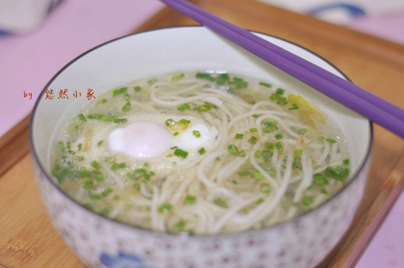

# 荷包蛋面条

## 📋 基本資訊 / Recipe Overview
- **料理名稱**：荷包蛋面条
- **原始標題**：荷包蛋面条
- **素食流派 / Diet**：蛋素 Ovo-Vegetarian
- **料理分類 / Category**：麵食料理
- **來源平台 / Source**：[豆果美食 · 素食專區](https://www.douguo.com/cookbook/1102587.html)

## 🌿 食材及佐料清單 / Ingredients
- 面条 400g
- 小葱 4根
- 鸡蛋 2个
- 酱烧葱花油 2勺
- 白醋 1勺
- 盐 1勺

## 🍳 烹飪步驟 / Step-by-Step Cooking Steps
1. 所需材料。
2. 小葱切碎。
3. 锅里烧水，水开后开最小火，将鸡蛋打入煮荷包蛋，先用最小火，让荷包蛋定型。
4. 另起一锅烧水，水开后下面条。
5. 荷包蛋煮好。
6. 将面条捞出，放上葱花和葱花油，调入适量盐和醋，再将荷包蛋舀入，最后将煮荷包蛋的汤过滤倒入即可。

## 💡 大廚美味秘訣 / Chef's Tips
- 酱烧葱花油就是将葱花放入碗中，倒入适量生抽，如果想要颜色深可用老抽，然后将油烧热，浇进去即可。

---
*食譜歸檔時間：2026-08-21 · 來源：豆果美食 (www.douguo.com)*