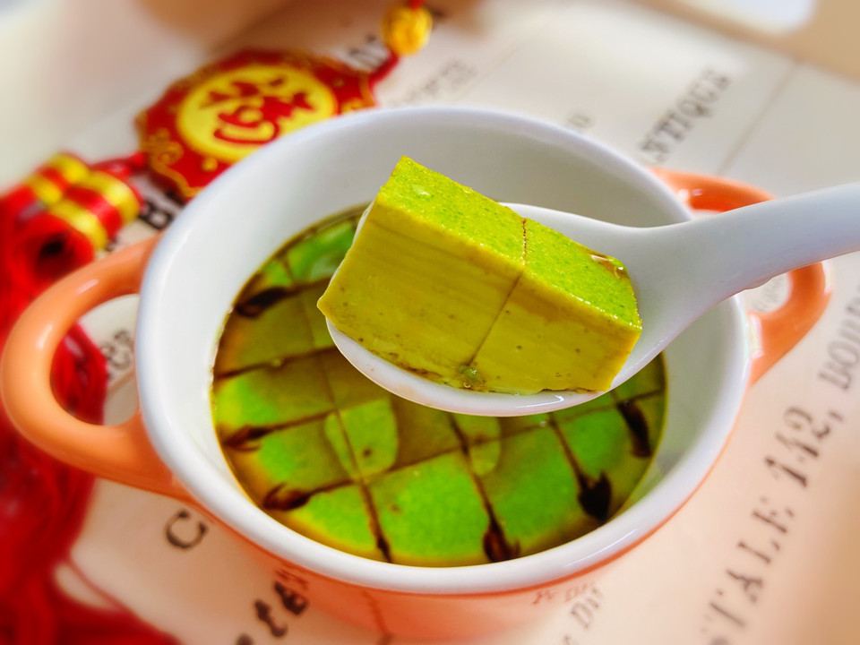

# 菠菜鸡蛋羹

## 📋 基本資訊 / Recipe Overview
- **料理名稱**：菠菜鸡蛋羹
- **原始標題**：菠菜鸡蛋羹
- **素食流派 / Diet**：蛋素 Ovo-Vegetarian
- **料理分類 / Category**：湯品羹湯
- **來源平台 / Source**：[豆果美食 · 素食專區](https://www.douguo.com/cookbook/2394747.html)

## 🌿 食材及佐料清單 / Ingredients
- 鸡蛋 2个
- 菠菜 2棵
- 盐 适量
- 油 少许
- 海鲜酱油 1小勺

## 🍳 烹飪步驟 / Step-by-Step Cooking Steps
1. 准备好食材
2. 菠菜清洗干净
3. 锅中加入清水大火烧开加入少许盐和食用油放入菠菜焯烫20秒捞起
4. 切小段放入碗中备用
5. 放入迷你破壁机
6. 加入100ml清水
7. 摁果汁键开启模式
8. 将菠菜汁倒入锅中
9. 鸡蛋打入碗中
10. 打散
11. 加入菠菜汁充分搅拌均匀
12. 取一筛网倒入蛋液
13. 再次过滤一遍，鸡蛋羹会更细腻
14. 盖上保鲜膜，用牙签扎几个洞。大火烧开转中火蒸八分钟后再焖两分钟
15. 蒸熟后的菠菜鸡蛋羹
16. 淋入少许海鲜酱油
17. 淋入少许香油
18. 细嫩的菠菜鸡蛋羹，营养丰富！

## 💡 大廚美味秘訣 / Chef's Tips
- 蛋液过滤两遍，这样蒸出来的蛋羹会更加细腻

---
*食譜歸檔時間：2026-08-21 · 來源：豆果美食 (www.douguo.com)*