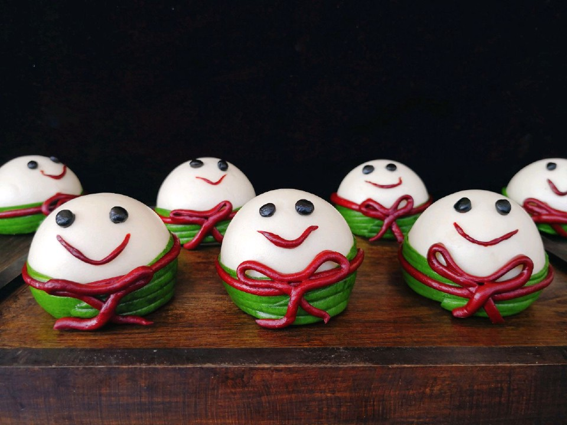

# 萌萌哒粽子馒头

## 📋 基本資訊 / Recipe Overview
- **料理名稱**：萌萌哒粽子馒头
- **原始標題**：萌萌哒粽子馒头
- **素食流派 / Diet**：全素 Vegan
- **料理分類 / Category**：烘焙麵點 / 點心
- **來源平台 / Source**：[豆果美食 · 素食專區](https://www.douguo.com/cookbook/2306425.html)

## 🌿 食材及佐料清單 / Ingredients
- 中筋面粉 280克
- 白砂糖 15克
- 水 140克
- 玉米油 5克
- 酵母 2.5克
- 竹炭粉 适量
- 红曲粉 适量
- 抹茶粉 适量

## 🍳 烹飪步驟 / Step-by-Step Cooking Steps
1. 夏天揉面可以把面粉密封放冰箱冷冻，液体材料也可以放冰箱冷藏后再用。
2. 把中粉，糖，酵母，水搅拌成棉絮状。
3. 揉到无干粉时加入玉米油。
4. 揉成非常光滑的面团。
5. 揉好的面团分割出一份5克加入适量竹炭粉，一份30克的加入适量红曲粉，一份50克的加入适量抹茶粉，剩下的就是白色面团了。
6. 三份小面团分别揉匀，放冰箱冷藏备用，如果是冬天可以放室温。
7. 白色面团分割成8等份，分别往里折叠，再次揉成光滑的面团。
8. 整理成圆柱形，顶部稍小些，放冰箱冷藏备用。
9. 把绿色面团搓成长条。
10. 分割成8等份。
11. 擀开，如图。
12. 对半切开。
13. 压出纹路，不要压断。
14. 稍微抹点水，粘在白色面团上，如图。
15. 粘上另一边放一边备用，夏天气温高的话就放冰箱冷藏备用。
16. 红曲粉面团擀平，切成17条小长条，其中16条做腰带，另外一条搓细做嘴巴用，只需很少。
17. 抹点水粘上。
18. 再取一条折成蝴蝶结形状，粘在腰带上，粘的时候可以抹点水。
19. 小细条当嘴巴，粘上，如图。
20. 黑色面团搓成16个小圆点，当眼睛，粘上，如图。
21. 蒸箱倒入适量纯净水，把做好的生面团放蒸箱上，醒发20分钟。蒸15分钟，焖2分钟取出即可。

## 💡 大廚美味秘訣 / Chef's Tips
- 没有蒸箱的就用普通蒸锅，用普通蒸锅一定要一次性加够足够的清水，中途不要开盖。

---
*食譜歸檔時間：2026-08-21 · 來源：豆果美食 (www.douguo.com)*