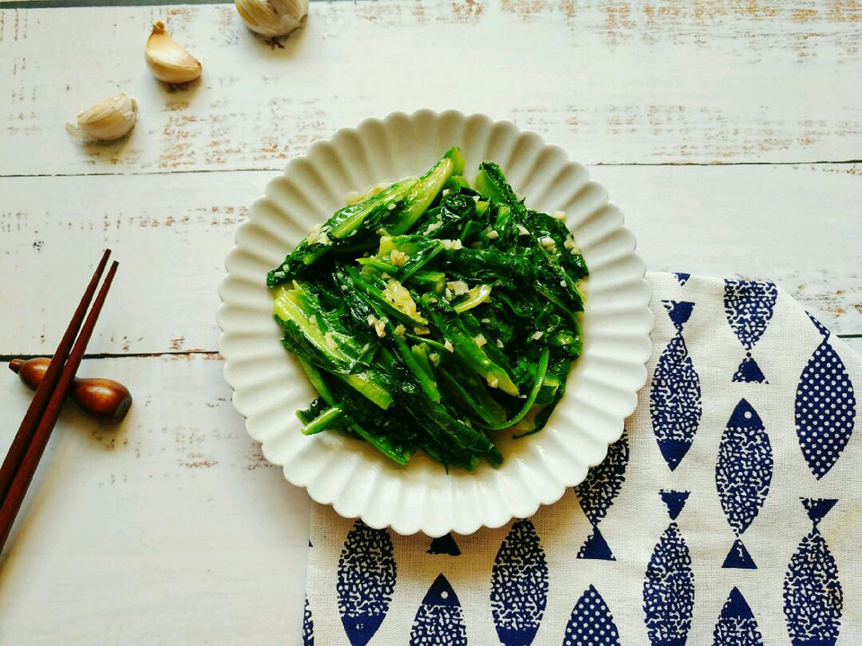

# 蒜蓉油麦菜

## 📋 基本資訊 / Recipe Overview
- **料理名稱**：蒜蓉油麦菜
- **原始標題**：蒜蓉油麦菜
- **素食流派 / Diet**：全素 Vegan
- **料理分類 / Category**：家常蔬食 / 經典熱菜
- **來源平台 / Source**：[豆果美食 · 素食專區](https://www.douguo.com/cookbook/2310076.html)

## 🌿 食材及佐料清單 / Ingredients
- 油麦菜 2棵
- 蒜瓣 6个
- 食盐 适量
- 食用油 适量

## 🍳 烹飪步驟 / Step-by-Step Cooking Steps
1. 准备食材
2. 蒜瓣拍扁切末备用
3. 油麦菜已经切段备用
4. 热锅倒入适量食用油烧至五成热
5. 倒入一半的蒜末爆香
6. 倒入油麦菜翻炒至熟
7. 加入适量食盐
8. 倒入剩下的蒜末炒匀
9. 出锅啦！

## 💡 大廚美味秘訣 / Chef's Tips
- 1、蒜末分成两次加进去这样炒出来蒜香味比较足！先爆香一半，临出锅再倒入另外一半。
2、炒油麦菜一定大火快炒，不要炒久了，久了就失去爽脆的口感了。
3、食盐的量根据个人口味来调整哦！

---
*食譜歸檔時間：2026-08-21 · 來源：豆果美食 (www.douguo.com)*