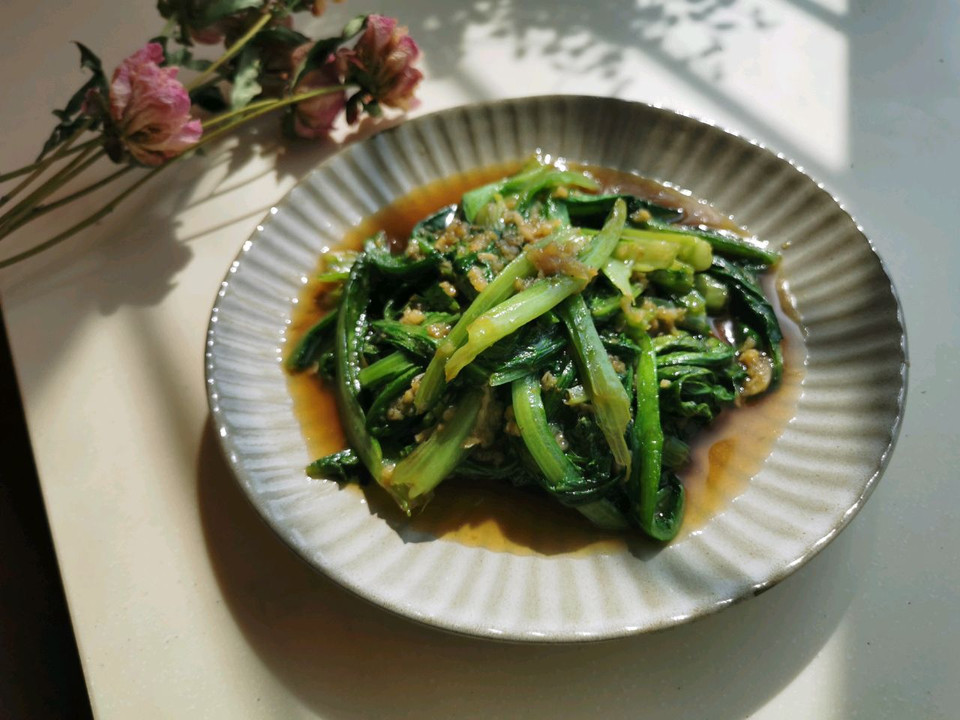

# 蒜蓉油麦菜

## 📋 基本資訊 / Recipe Overview
- **料理名稱**：蒜蓉油麦菜
- **原始標題**：蒜蓉油麦菜
- **素食流派 / Diet**：全素 Vegan
- **料理分類 / Category**：家常蔬食 / 經典熱菜
- **來源平台 / Source**：[豆果美食 · 素食專區](https://www.douguo.com/cookbook/2483230.html)

## 🌿 食材及佐料清單 / Ingredients
- 油麦菜 200克
- 蒜 20克
- 油 0.5勺
- 蚝油 1勺
- 生抽
- 花椒粉

## 🍳 烹飪步驟 / Step-by-Step Cooking Steps
1. 首先把蒜咋成蒜蓉备用，油麦菜洗净切段
2. 在调一个料汁，耗油，生抽，花椒粉，一点点淀粉，一勺水调匀备用
3. 锅内放油，小火把蒜蓉炒香
4. 下入洗净的油麦菜大火翻炒
5. 出香味断生后加入调好的料汁翻炒
6. 拌匀后就可以出锅了
7. 炒的时候不需要放盐
8. 这样炒出来的油麦菜比较入

## 💡 大廚美味秘訣 / Chef's Tips
- 小火慢炖流失的营养更高，因为维生素C、B1都怕热、怕煮。而大火快炒的菜维生素C损失仅17％，若炒后再焖，菜里的维生素C将损失59％。所以炒菜要用旺火，这样炒出来的菜，不仅色美味好，而且菜里的营养损失也少

---
*食譜歸檔時間：2026-08-21 · 來源：豆果美食 (www.douguo.com)*