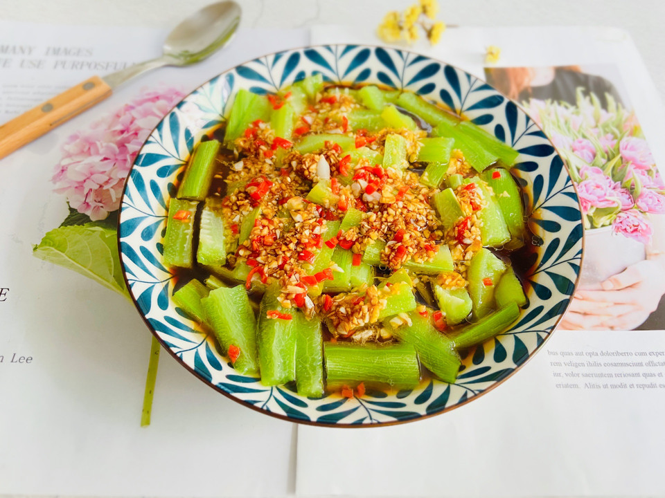

# 蒜蓉蒸丝瓜

## 📋 基本資訊 / Recipe Overview
- **料理名稱**：蒜蓉蒸丝瓜
- **原始標題**：蒜蓉蒸丝瓜
- **素食流派 / Diet**：全素 Vegan
- **料理分類 / Category**：家常蔬食 / 經典熱菜
- **來源平台 / Source**：[豆果美食 · 素食專區](https://www.douguo.com/cookbook/2518739.html)

## 🌿 食材及佐料清單 / Ingredients
- 丝瓜 1根
- 蒜头 半头
- 辣椒 2个
- 盐 1克
- 生抽 1勺
- 香醋 2勺
- 白胡椒粉 适量
- 鸡精 2克
- 食用油 适量

## 🍳 烹飪步驟 / Step-by-Step Cooking Steps
1. 准备好食材
2. 丝瓜洗净去皮切小段
3. 放入盘中备用
4. 辣椒切碎
5. 蒜头去皮放入料理机中打碎
6. 放入碗中
7. 放入辣椒碎
8. 根据个人口味加入适量盐
9. 加入适量鸡精
10. 加入白胡椒粉
11. 加入一勺生抽
12. 加入两勺香醋
13. 倒入热油
14. 搅拌均匀即可
15. 将调料汁倒入丝瓜中
16. 上锅大火蒸八分钟即可
17. 成品图
18. 蒜蓉蒸丝瓜，清甜不油腻！

---
*食譜歸檔時間：2026-08-21 · 來源：豆果美食 (www.douguo.com)*