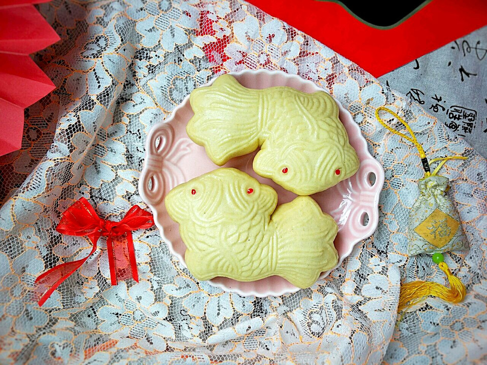

# 蒸蒸日上金鱼馒头

## 📋 基本資訊 / Recipe Overview
- **料理名稱**：蒸蒸日上金鱼馒头
- **原始標題**：蒸蒸日上金鱼馒头
- **素食流派 / Diet**：全素 Vegan
- **料理分類 / Category**：烘焙麵點 / 點心
- **難易度 / Difficulty**：配菜(中级)
- **烹飪時間 / Cooking Time**：1小时以上
- **來源平台 / Source**：[豆果美食 · 素食專區](https://www.douguo.com/cookbook/2393252.html)

## 📝 料理故事與簡介 / Story & Introduction
> 新年的脚步声越来越近，在农村噼噼啪啪的鞭炮声感觉年味比市里更浓一些。昨天小年回婆婆那边吃晚饭，带回了这个金鱼卡子模具，婆婆说这个模具有很多很多年了呢，过年蒸金鱼馒头是老传统啦，在我们这边几乎家家户户都会蒸些馒头备着过年。过年蒸馒头，寓意蒸蒸日上，今天制作的是金鱼馒头喜欢的一起来制作吧～

## 🌿 食材及佐料清單 / Ingredients
- 中筋面粉：230克
- 玉米面粉：70克
- 清水：150克
- 酵母：3克
- 中筋面粉(备用)：适量
- 粉色食用色素(可不用)：少许

## 🍳 烹飪步驟 / Step-by-Step Cooking Steps
1. 准备一下所需食材。
2. 把中筋面粉、玉米面、酵母放在一起搅拌均匀。
3. 在面粉中加入清水。
4. 揉成光滑面团盖保鲜膜醒发1小时左右。具体醒发时间根据室温和面团醒发状态决定。
5. 面团醒发至原来的2倍大左右，手指戳个洞，洞口不回缩不塌陷即可。
6. 把面团分少量多次加入备用的中筋粉揉搓均匀。中筋面粉的用量根据自己喜欢即可，多揉进去一些吃起来馒头会更劲道的噢。
7. 把面团揉搓光滑。
8. 把面团分成4等份。
9. 取一小份面团揉搓成长条状。
10. 准备金鱼馒头卡子模具，撒少量干面粉防粘。
11. 把面团放入金鱼模具中。
12. 压实，要压的厚薄一致噢。
13. 倒扣脱模即可，一条金鱼馒头生胚就做好啦。
14. 锅中倒入冷水，依次做好其余的馒头放入蒸屉盖锅盖，二次醒发约20分钟，醒发至馒头体积略略膨胀，手感轻盈，手指轻按面团慢慢回弹的程度即可开大火蒸，水开后再蒸25分钟左右，关火闷5分钟。
15. 出锅后趁热用筷子尖粘少量粉色食用色素点在金鱼眼睛上即可。
16. 成品图
17. 成品图
18. 成品图

## 💡 大廚美味秘訣 / Chef's Tips
- 1.面粉干湿度不同，用水量可酌情增减。
2.醒发好的面团尽量多揉进一些干面粉会劲道好吃。
3.密封冷藏保存，可冷冻，再吃时热一下即可。

---
*食譜歸檔時間：2026-08-20 · 來源：豆果美食 (www.douguo.com)*