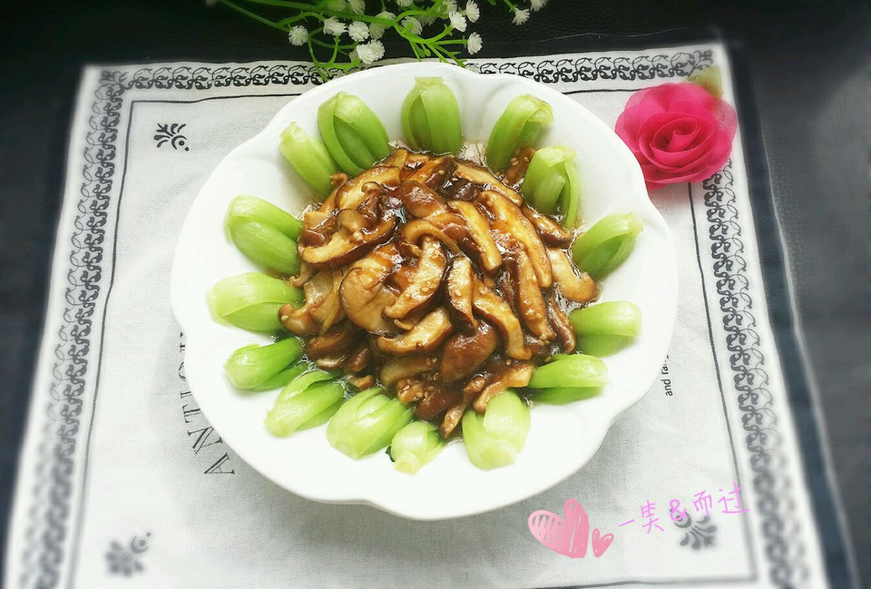

# 蚝汁香菇油菜

## 📋 基本資訊 / Recipe Overview
- **料理名稱**：蚝汁香菇油菜
- **原始標題**：蚝汁香菇油菜
- **素食流派 / Diet**：全素 Vegan
- **料理分類 / Category**：養生飲品 / 甜湯
- **來源平台 / Source**：[豆果美食 · 素食專區](https://www.douguo.com/cookbook/1415278.html)

## 🌿 食材及佐料清單 / Ingredients
- 油菜 10颗
- 香菇 150g
- 蚝油 1大勺
- 糖 1小勺
- 生抽 1勺
- 盐（焯油菜） 1小勺
- 油（焯油菜） 1小勺
- 芝麻 适量
- 姜丝 适量
- 水淀粉 2勺

## 🍳 烹飪步驟 / Step-by-Step Cooking Steps
1. 香菇洗干净，切片，姜丝，油菜洗干净，中间切一刀。
2. 烧小半锅水，给一勺盐，一勺油，水开了放入油菜。
3. 不用盖锅盖，1分钟就熟了
4. 油菜摆盘
5. 油热给姜丝
6. 放入香菇
7. 给一大勺蚝油，一勺生抽，一小勺糖，翻炒
8. 炒到香菇软软的
9. 给一点水淀粉，撒点芝麻就好了
10. 好吃

## 💡 大廚美味秘訣 / Chef's Tips
- 焯水油菜放盐，可以使菜颜色更绿，放油也是使菜颜色漂亮，口感更好。

---
*食譜歸檔時間：2026-08-21 · 來源：豆果美食 (www.douguo.com)*