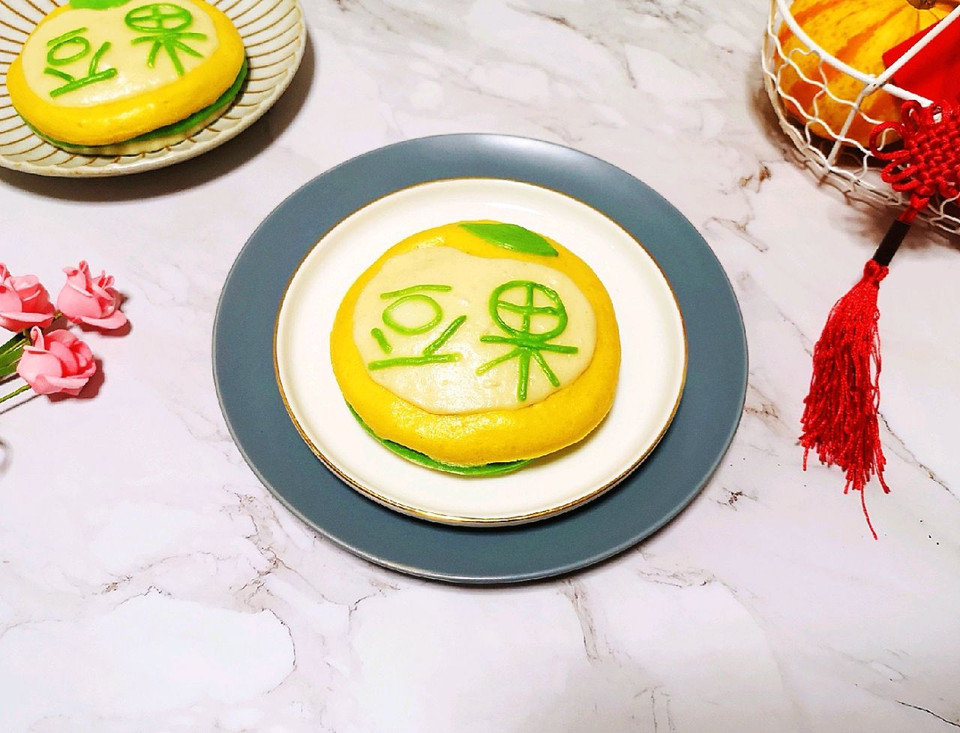

# 豆果logo馒头

## 📋 基本資訊 / Recipe Overview
- **料理名稱**：豆果logo馒头
- **原始標題**：豆果logo馒头
- **素食流派 / Diet**：全素 Vegan
- **料理分類 / Category**：烘焙麵點 / 點心
- **難易度 / Difficulty**：配菜(中级)
- **烹飪時間 / Cooking Time**：1小时以上
- **來源平台 / Source**：[豆果美食 · 素食專區](https://www.douguo.com/cookbook/2391728.html)

## 📝 料理故事與簡介 / Story & Introduction
> 陪伴了好几年的豆果美食换新logo啦！一起来庆祝一下！

## 🌿 食材及佐料清單 / Ingredients
- 黄色面团食材
- 板栗南瓜（净重）：220g
- 发酵粉：4g
- 中筋面粉：330g
- 白色面团食材
- 中筋面粉：160g
- 温水：82g
- 糖：8g
- 发酵粉：1.5g
- 绿色食用色素：少许

## 🍳 烹飪步驟 / Step-by-Step Cooking Steps
1. 板栗南瓜去皮去瓤，洗干净切成片。
2. 放在盘子里隔水蒸熟。
3. 准备好中筋面粉（这个是做白色面团用的）。
4. 温水里面加入发酵粉和糖混合均匀。
5. 分次加入面粉中，用筷子挑拌成絮状。
6. 揉成光滑的面团，盖上保鲜膜发酵至两倍大。
7. 蒸熟的南瓜片从蒸锅里取出，放入盆里晾至温热，加入发酵粉用勺子压成南瓜泥。
8. 加入中筋面粉。
9. 用筷子挑拌成絮状。
10. 揉成光滑的面团，盖上保鲜膜发酵至两倍大。
11. 发酵好的黄色面团揉光排气备用。
12. 发酵好的白色面团揉光排气备用。
13. 把白色面团分三分之一出来，加入一点点绿色的食用色素揉成绿色的面团备用。
14. 将各色的面团用擀面杖擀成厚厚的大饼状，用圆形的模具刻出圆片。
15. 将三个颜色的圆片摞在一起，黄色的放在最上面，用擀面杖轻轻地擀一下，剩余白色的面团擀成薄一点的面片，用剪刀剪出白色的豆子部分，沾点水贴在黄色面团上面。
16. 剩余绿色的面团擀成薄一点的面片，剪出叶子形状，沾水贴在黄色面团上面。
17. 再将绿色的面团擀至更薄，用剪刀剪成细条状，摆出“豆果”字样，豆果logo馒头就完成了。
18. 蒸锅内放水，篦子上铺上硅胶垫，放上做好的馒头生胚，盖上锅盖二次发酵10分钟左右，凉水上锅，大火烧开以后转中火蒸15分钟关火，焖5-10分钟出锅。
19. 豆果logo馒头出锅了。
20. 好漂亮有木有。
21. 舍不得吃了。
22. 祝愿豆果美食蒸蒸日上。

## 💡 大廚美味秘訣 / Chef's Tips
- 馒头制作的过程中面团一定要用保鲜膜盖上，要不然就干了。

---
*食譜歸檔時間：2026-08-20 · 來源：豆果美食 (www.douguo.com)*