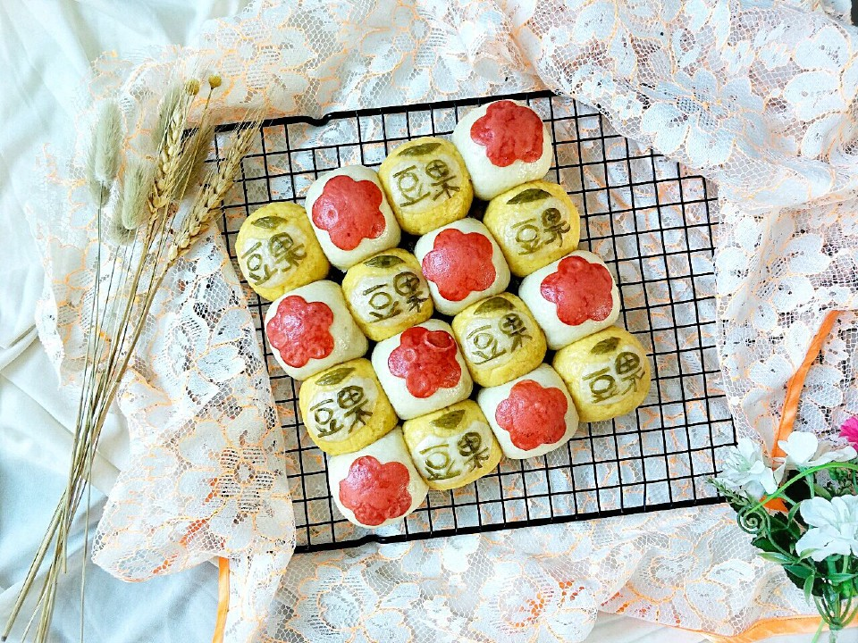

# 豆果小馒头

## 📋 基本資訊 / Recipe Overview
- **料理名稱**：豆果小馒头
- **原始標題**：豆果小馒头
- **素食流派 / Diet**：全素 Vegan
- **料理分類 / Category**：烘焙麵點 / 點心
- **難易度 / Difficulty**：配菜(中级)
- **烹飪時間 / Cooking Time**：30~60分钟
- **來源平台 / Source**：[豆果美食 · 素食專區](https://www.douguo.com/cookbook/2391512.html)

## 📝 料理故事與簡介 / Story & Introduction
> 可爱的豆果小馒头～

## 🌿 食材及佐料清單 / Ingredients
- 中筋面粉(白)：180克
- 酵母(白)：2克
- 清水(白)：90克
- 中筋面粉(黄)：100克
- 玉米面(黄)：50克
- 酵母(黄)：1.5克
- 清水(黄)：75克
- 红曲米粉：1克
- 抹茶粉：1克

## 🍳 烹飪步驟 / Step-by-Step Cooking Steps
1. 准备食材。
2. 白色面团部分:面粉与酵母搅拌均匀后倒入清水。
玉米面团部分:玉米面粉与面粉加入酵母搅拌均匀后倒入清水。
3. 分别揉成光滑的面团盖保鲜膜醒发1小时左右。室温高要缩短醒发时间。
4. 面团分别醒发至原来的2倍大左右，手指戳个洞洞口不回缩即可。
5. 把两块面团分别揉搓排出空气，可撒适量干面粉防粘。
6. 把白色面团分出3个15克的小面团，其中两个小面团分别加入红曲米粉和抹茶粉揉搓成红色面团和绿色面团。
7. 把白色大面团和黄色面团分别分成8等份揉圆。
8. 22厘米方形模具刷一层植物油防粘，把小面团交叉摆入模具中。
9. 把红色面团擀成厚度约1mm的薄片，用花朵模具刻出花朵。
10. 把白色面团擀成厚度为1mm左右的薄片，用刀刻出豆果的可爱小豆。
11. 把绿色面团也擀成厚度为1 mm的薄片，用刀刻出小叶子，其余的绿色面签制作"豆果"字样。
12. 分别粘少量清水贴在圆形面团上即可。冷水下锅，把馒头放入蒸屉开大火，水开后再蒸25分钟左右，关火闷5分钟左右。
13. 出锅啦～
14. 成品图
15. 成品图

## 💡 大廚美味秘訣 / Chef's Tips
- 面粉干湿度不同，用水量可酌情增减。

---
*食譜歸檔時間：2026-08-20 · 來源：豆果美食 (www.douguo.com)*