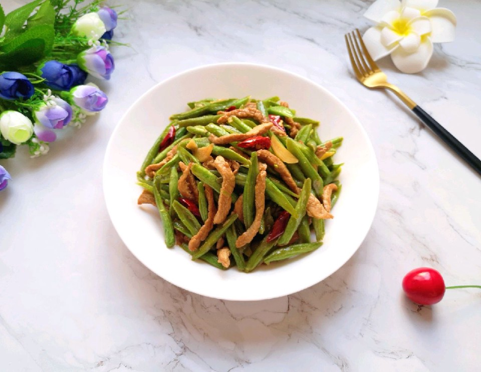

# 豆角炒肉

## 📋 基本資訊 / Recipe Overview
- **料理名稱**：豆角炒肉
- **原始標題**：豆角炒肉
- **素食流派 / Diet**：全素 Vegan
- **料理分類 / Category**：家常蔬食 / 經典熱菜
- **難易度 / Difficulty**：切墩(初级)
- **烹飪時間 / Cooking Time**：10分钟左右
- **來源平台 / Source**：[豆果美食 · 素食專區](https://www.douguo.com/cookbook/2390153.html)

## 📝 料理故事與簡介 / Story & Introduction
> 吃了还想吃的家常菜。

## 🌿 食材及佐料清單 / Ingredients
- 豆角：260g
- 瘦肉：150g
- 大蒜：3瓣
- 干红辣椒：2个
- 生姜：2片
- 鸡粉：2g
- 老抽：2g
- 食用油：适量
- 味极鲜酱油：1勺
- 盐：适量
- 蔬之鲜：半勺

## 🍳 烹飪步驟 / Step-by-Step Cooking Steps
1. 瘦肉和生姜切成丝放在一起。
2. 加入鸡粉、老抽和少许食用油。
3. 搅拌均匀，腌制15分钟左右。
4. 豆角掐头去尾清洗干净控一下水，斜着切成段（这样切豆角好熟易入味）。
5. 大蒜切成片，干红辣椒切成小段。
6. 炒锅内倒适量的食用油烧热，下入肉丝炒熟盛出备用。
7. 锅底留余油，下入大蒜和干红辣椒炒香。
8. 下入豆角翻炒至变色。
9. 加入一勺味极鲜酱油翻炒均匀。
10. 放盐调味，加少许水盖上锅盖焖炒2分钟。
11. 下入炒好的肉丝。
12. 翻炒均匀。
13. 放蔬之鲜提味。
14. 翻炒均匀关火出锅。
15. 准备开饭了。
16. 宝贝连说好吃好吃。

## 💡 大廚美味秘訣 / Chef's Tips
- 豆角一定要炒熟透了才可以食用，否则会中毒。

---
*食譜歸檔時間：2026-08-20 · 來源：豆果美食 (www.douguo.com)*