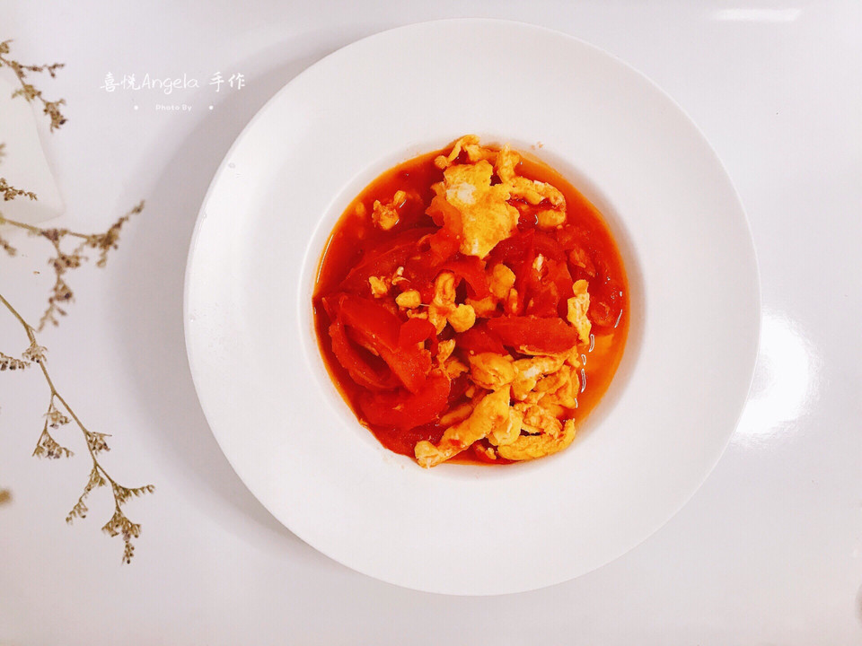

# 超下饭的番茄炒蛋

## 📋 基本資訊 / Recipe Overview
- **料理名稱**：超下饭的番茄炒蛋
- **原始標題**：超下饭的番茄炒蛋
- **素食流派 / Diet**：蛋素 Ovo-Vegetarian
- **料理分類 / Category**：家常蔬食 / 經典熱菜
- **難易度 / Difficulty**：切墩(初级)
- **烹飪時間 / Cooking Time**：10~30分钟
- **來源平台 / Source**：[豆果美食 · 素食專區](https://www.douguo.com/cookbook/2442586.html)

## 📝 料理故事與簡介 / Story & Introduction
> 简单的食材
甜到心坎的滋味

超好哄宝贝吃饭的一味菜~哈哈~

## 🌿 食材及佐料清單 / Ingredients
- 番茄：2个
- 鸡蛋：2个
- 糖：适量
- 盐：适量
- 油：适量

## 🍳 烹飪步驟 / Step-by-Step Cooking Steps
1. 1、材料准备：番茄、鸡蛋洗干净。
2. 2、番茄切片，切薄些，方便入味。
3. 3、放砂糖，搅拌均匀，腌上30分钟（图上的小木勺，我放了3勺的糖）
4. 4、鸡蛋磕碗里，放些许盐，用筷子打散。
5. 5、将锅烧热，再放入一大勺油，将鸡蛋液淋入锅中，快成型的时候用筷子迅速打散。
6. 6、腌好的番茄会有很多汤汁，先把汤汁倒入碗里备用。

起锅，放入少许油

把腌好的番茄倒入锅里翻炒，然后再倒入番茄汤汁翻炒片刻。
7. 7、因为喜欢汁多，我加了两小碟的温水

把鸡蛋倒入，再调入了些许糖，少许盐

翻炒片刻，装盘。
8. 番茄炒蛋出锅了~
9. 看着就直流口水~哈哈~
10. 甜甜的口味，满满的幸福感
太好下饭了，单单一碟番茄炒蛋，就可以吃下两碗饭~嘿嘿……

---
*食譜歸檔時間：2026-08-20 · 來源：豆果美食 (www.douguo.com)*