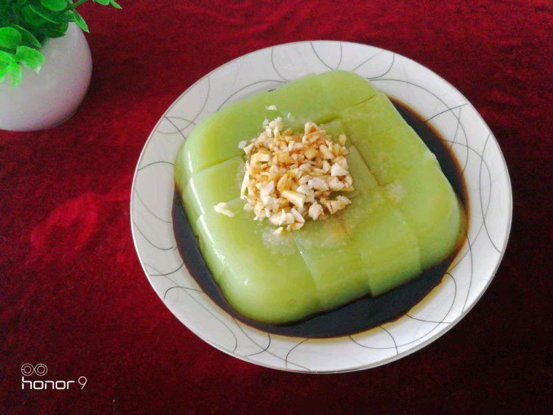

# 超简单版的夏日菠菜凉粉

## 📋 基本資訊 / Recipe Overview
- **料理名稱**：超简单版的夏日菠菜凉粉
- **原始標題**：超简单版的夏日菠菜凉粉
- **素食流派 / Diet**：全素 Vegan
- **料理分類 / Category**：家常蔬食 / 經典熱菜
- **來源平台 / Source**：[豆果美食 · 素食專區](https://www.douguo.com/cookbook/3108422.html)

## 🌿 食材及佐料清單 / Ingredients
- 菠菜 180克
- 玉米淀粉 100克
- 水 1100克
- 醋 1勺
- 生抽 2勺
- 盐 适量
- 香油 1勺
- 蒜 4瓣
- 辣椒 随意

## 🍳 烹飪步驟 / Step-by-Step Cooking Steps
1. 锅里放水，水开将菠菜焯水，捞出过凉。
2. 将菠菜切成段放入榨汁机。
3. 放入和菠菜齐平的水榨成汁。
4. 将菠菜汁里放入100克玉米淀粉搅拌均匀。
5. 锅中放入1100克水。
6. 全程小火，将菠菜玉米淀粉调成的汁，一点点倒入水中，并且用筷子不停地搅拌。
7. 搅拌到开始冒大泡即可。
8. 事先将容器里沫点油，好脱膜，将凉粉盛到容器中，盖上盖子放入冰箱冷藏3一4个小时。
9. 从冰箱里冷藏好的凉粉。
10. 倒扣在盘中。
11. 放入切好的蒜沫，一勺醋、2勺生抽、适量的盐和一勺香油，喜欢辣的朋友可以放点辣椒油之类，就可以美美的享用了，菠菜凉菜Q弹顺滑，炎炎夏日，吃上自己做的凉粉，既美味又健康！

---
*食譜歸檔時間：2026-08-21 · 來源：豆果美食 (www.douguo.com)*