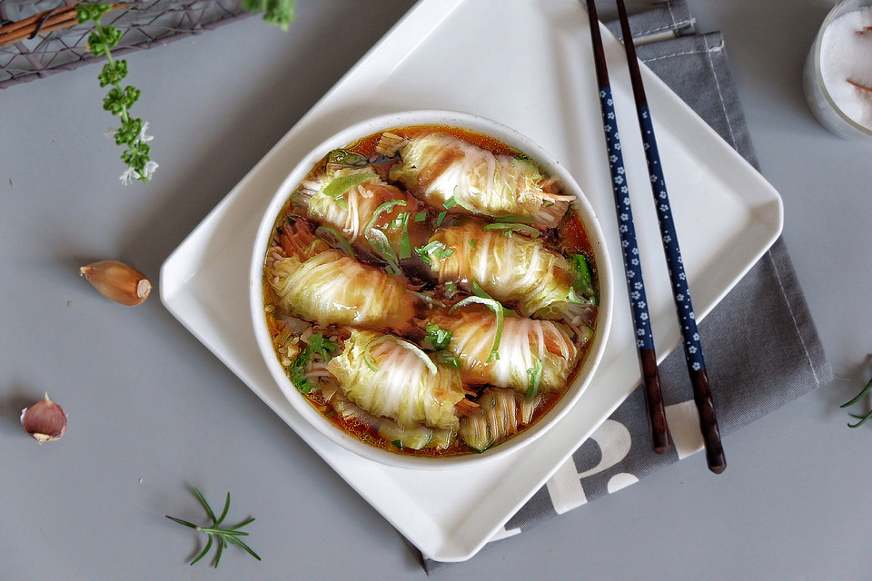

# 金针菇白玉卷（无油）

## 📋 基本資訊 / Recipe Overview
- **料理名稱**：金针菇白玉卷（无油）
- **原始標題**：金针菇白玉卷（无油）
- **素食流派 / Diet**：全素 Vegan
- **料理分類 / Category**：家常蔬食 / 經典熱菜
- **來源平台 / Source**：[豆果美食 · 素食專區](https://www.douguo.com/cookbook/1722480.html)

## 🌿 食材及佐料清單 / Ingredients
- 娃娃菜 1个
- 金针菇 150克
- 胡萝卜 1/3个
- 盐 少许
- 蚝油 1汤匙
- 蒸鱼豉油 1勺
- 水 2汤匙
- 淀粉 1勺

## 🍳 烹飪步驟 / Step-by-Step Cooking Steps
1. 娃娃菜洗净撕成一片一片的
2. 金针菇不要切去根部哦。直接这样洗干净。
3. 胡萝卜擦成丝
4. 蚝油，蒸鱼豉油，盐，淀粉，水混合调成酱汁备用
5. 锅中烧开水，先放入娃娃菜
6. 等娃娃菜烫至7成软的时候，直接放入金针菇一起烫熟
7. 取出金针菇，沥干水份
8. 放到菜板上
9. 好了，现在来切去根部。 看，这样出来的金针菇是非常整齐的，而不是从锅中捞出的乱七八糟的一大坨。 这样一会用一点撕下来一点，好看干净省时间。 我没有强迫症，但是这个小窍门真的很好用。
10. 娃娃菜捞出沥干水份
11. 取一片叶子，铺平整
12. 揪一撮金针菇下来，铺在根部 金针菇是不是很整齐？毫不费力。
13. 在铺上少许胡萝卜丝
14. 从右向左卷起来。
15. 依次做好
16. 放入锅中，先不要开火哦。 等全部放完在开火
17. 好了开火，倒入酱汁
18. 酱汁能没过菜卷的一半就可以了，不要拿铲子翻动哦
19. 转中火，将汤汁煮到浓稠。OK关火
20. 用筷子夹到盘子里，剩余的酱汁淋上，撒上点葱末即可

## 💡 大廚美味秘訣 / Chef's Tips
- 同样的方式还可以使用圆白菜，白菜等这种大叶菜来烹饪。

---
*食譜歸檔時間：2026-08-21 · 來源：豆果美食 (www.douguo.com)*