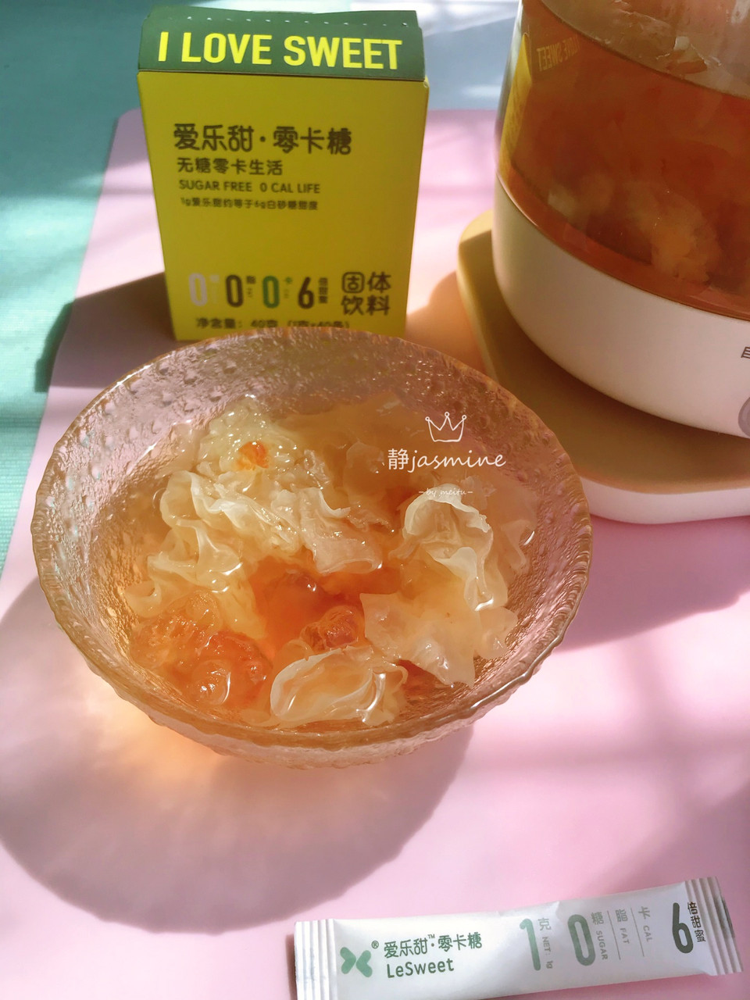

# 银耳汤

## 📋 基本資訊 / Recipe Overview
- **料理名稱**：银耳汤
- **原始標題**：银耳汤
- **素食流派 / Diet**：全素 Vegan
- **料理分類 / Category**：湯品羹湯
- **來源平台 / Source**：[豆果美食 · 素食專區](https://www.douguo.com/cookbook/2513525.html)

## 🌿 食材及佐料清單 / Ingredients
- 银耳 适量
- 桃胶 适量
- 红糖 适量
- 爱乐甜 适量

## 🍳 烹飪步驟 / Step-by-Step Cooking Steps
1. 准备原材料
2. 水开后放入桃胶
3. 银耳煮30分钟
4. 放红糖再煮20分钟
5. 炖好的银耳汤
6. 喝的时候放爱乐甜调味

## 💡 大廚美味秘訣 / Chef's Tips
- 之前为了减糖，味道会差一些
有了爱乐甜就不用担心了，放少量红糖提味，喝的时候再加爱乐甜，就是自己喜欢的口味

---
*食譜歸檔時間：2026-08-21 · 來源：豆果美食 (www.douguo.com)*