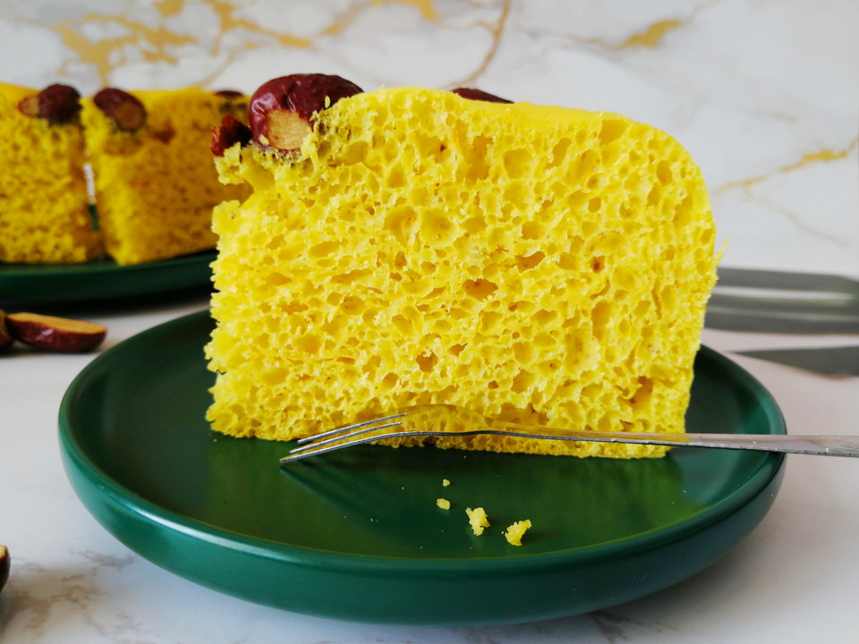

# 零失败的南瓜发糕

## 📋 基本資訊 / Recipe Overview
- **料理名稱**：零失败的南瓜发糕
- **原始標題**：零失败的南瓜发糕的做法
- **素食流派 / Diet**：蛋素 Ovo-Vegetarian
- **料理分類 / Category**：烘焙麵點 / 點心
- **來源平台 / Source**：[豆果美食 · 素食專區](https://www.douguo.com/cookbook/2451497.html)

## 🌿 食材及佐料清單 / Ingredients
- 南瓜泥 300克
- 面粉 300克
- 鸡蛋 2个
- 糖 30克
- 酵母 3克
- 红枣 若干

## 🍳 烹飪步驟 / Step-by-Step Cooking Steps
1. 准备好各种制作材料，南瓜去皮切小块蒸熟，蒸熟的重量是300克，面粉选用普通的中筋面粉就可以了，也是300克，和南瓜的重量是一样的，当然，最后还是要根据南瓜的湿度来调节。红枣提前用淡盐水浸泡清洗干净。糖30克左右，南瓜本身具有一定的甜度，糖的分量可以根据实际需求调整。
2. 先把蒸熟的南瓜碾压成泥，蒸熟的南瓜非常软烂，随便用个铲子勺子就可以压烂，不需要额外的工具。
3. 打入两个鸡蛋混合均匀。加入鸡蛋可以让发糕的口感更软，喜欢筋道的也可以不用鸡蛋，但是面粉的用量需要重新调整。
4. 放入糖和酵母搅拌均匀。酵母要选择耐高糖的酵母，最好不要和糖直接接触。
5. 最后加入面粉混合均匀，搅拌至没有干粉的状态即可。搅拌好的面粉看起来黏乎乎的，比较湿的状态，但是不会流动。
6. 发酵至两倍大后，用刮刀搅拌排气，倒入模具进行二次发酵。二次发酵可以不是必须的，一次发酵也一样可以做成功，且更省时，但是经过二次发酵的发糕气孔更匀称，口感也会更好。大家可以根据自己的需求来决定是否二次发酵。
7. 模具里先垫入油纸，再倒入排好气面糊，方便后期脱模，没有油纸的，也可以在模具底部刷一层无味植物油。 表面不够平整的，可以用刮刀蘸少许清水稍整一下即可，蘸清水可以防止湿粘的面团跟着刮刀乱跑。
8. 继续放在温暖湿润处发酵至1.5-2倍大。放上红枣摆成任意自己喜欢的图形，也可以用蔓越莓，葡萄干，黑芝麻等其他的干果。
9. 最后放入蒸锅蒸40分钟，关火再焖3分钟出锅。这里食材的份量做好刚好是8寸满模。
10. 因为有油纸，非常容易脱膜，而且周边也特别的光滑。切开，内部组织非常匀称，弹力也非常好，金灿灿的颜色非常诱人，咬上一口，南瓜的清香伴着一点点的清甜，细腻丰弹。手撕着也非常好吃，不知不觉就吃下了一大块。

## 💡 大廚美味秘訣 / Chef's Tips
- 1.配方中的食材重量仅供参考，蒸好的南瓜含水量不同，鸡蛋的大小一样，面粉的吸水性也有差别。不过制作发糕的干湿度并没有馒头之类的严格，稍稍稀点干点问题都不是特别大。湿度越大的发糕口感越黏。 
 
2.吃不完的发糕及时用保鲜袋密封保存起来，防止风干。需要长期保存的可以冷藏冷冻，下次食用的时候复蒸即可。 
 
3.加入鸡蛋可以让发糕的口感更软，如果喜欢筋道的，也可以不用鸡蛋，不过面粉的用量需要重新调整。 
 
4.制作发糕可以一次发酵也可以二次发酵，经过二次发酵的发糕气孔更细密匀称，口感也更好。

---
*食譜歸檔時間：2026-08-21 · 來源：豆果美食 (www.douguo.com)*