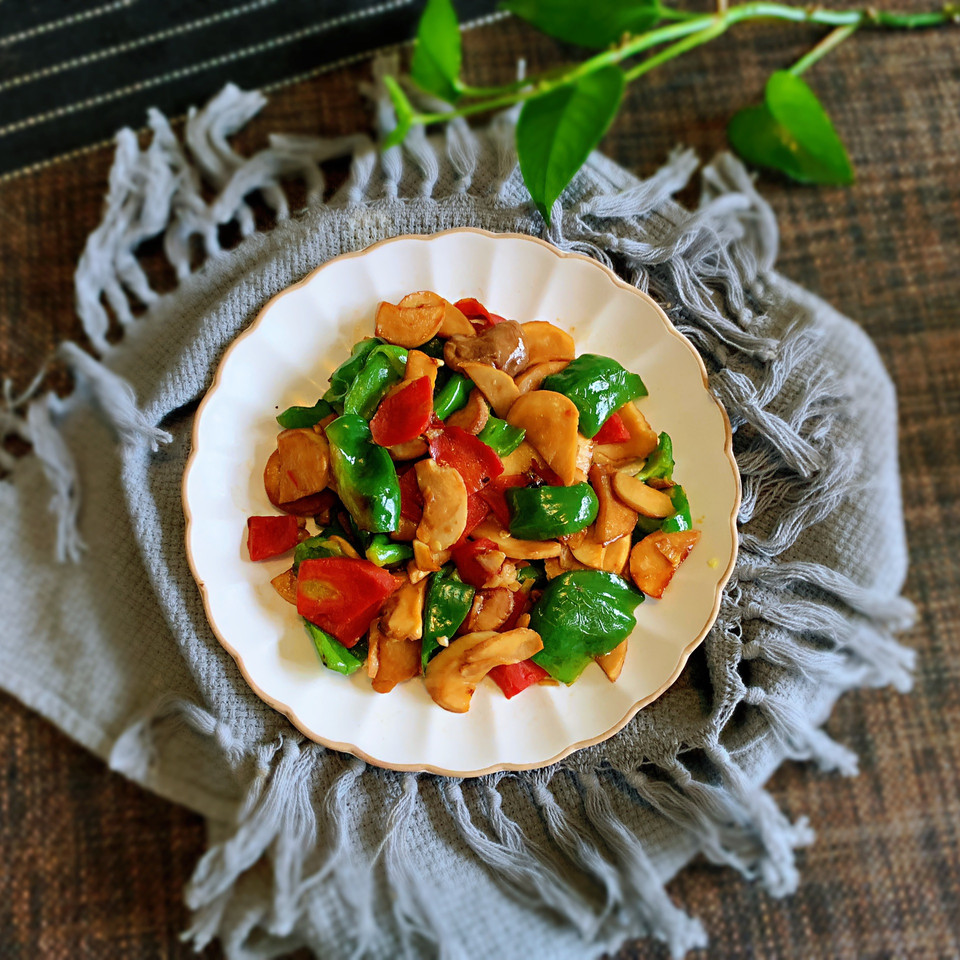

# 青椒杏鲍菇

## 📋 基本資訊 / Recipe Overview
- **料理名稱**：青椒杏鲍菇
- **原始標題**：青椒杏鲍菇
- **素食流派 / Diet**：全素 Vegan
- **料理分類 / Category**：家常蔬食 / 經典熱菜
- **難易度 / Difficulty**：切墩(初级)
- **烹飪時間 / Cooking Time**：10~30分钟
- **來源平台 / Source**：[豆果美食 · 素食專區](https://www.douguo.com/cookbook/2356707.html)

## 📝 料理故事與簡介 / Story & Introduction
> 今天做个简单的家常菜.青椒香鲍菇.鲜香还美味.大家快来看下制作过程吧！

## 🌿 食材及佐料清單 / Ingredients
- 青椒：1个
- 香鲍菇：1个
- 胡萝卜：半根
- 蒜：6瓣
- 味极鲜：适量
- 耗油：适量
- 盐：适量
- 油：适量

## 🍳 烹飪步驟 / Step-by-Step Cooking Steps
1. 准备食材.青椒掰小块. 蒜拍下切末. 胡萝卜切片.杏鲍菇切片
2. 起锅放油.七分热放蒜末爆香后放入胡萝卜
3. 然后放入杏鲍菇炒下.
4. 在放入青椒.
5. 最后倒入味极鲜.耗油.盐翻炒均匀大概炒2分钟左右让其入味.后关火。
6. 出锅装盘.看着很有食欲吧.就这么简单.大家快来试做下吧！

---
*食譜歸檔時間：2026-08-20 · 來源：豆果美食 (www.douguo.com)*