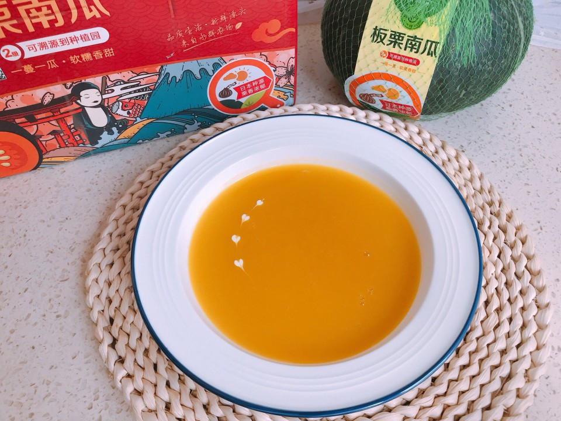

# 韩式南瓜粥

## 📋 基本資訊 / Recipe Overview
- **料理名稱**：韩式南瓜粥
- **原始標題**：韩式南瓜粥
- **素食流派 / Diet**：全素 Vegan
- **料理分類 / Category**：米食料理
- **來源平台 / Source**：[豆果美食 · 素食專區](https://www.douguo.com/cookbook/3098520.html)

## 🌿 食材及佐料清單 / Ingredients
- 南瓜 一块
- 清水 250克
- 砂糖 3克
- 糯米粉 15克

## 🍳 烹飪步驟 / Step-by-Step Cooking Steps
1. 准备好所需食材，安心可溯源的板栗南瓜
2. 洗净后切片
3. 去皮后入锅蒸10分钟，用筷子戳下能戳动就好了
4. 蒸熟的南瓜加适量清水打成泥
5. 倒入锅中再加一碗清水
6. 加一勺糯米粉（大概15克左右）边加热边搅拌，煮熟即可出锅，可根据个人口味加适量砂糖
7. 表面用淡奶油装饰下，画个小心心
8. 开动吧，美味的南瓜粥

---
*食譜歸檔時間：2026-08-21 · 來源：豆果美食 (www.douguo.com)*