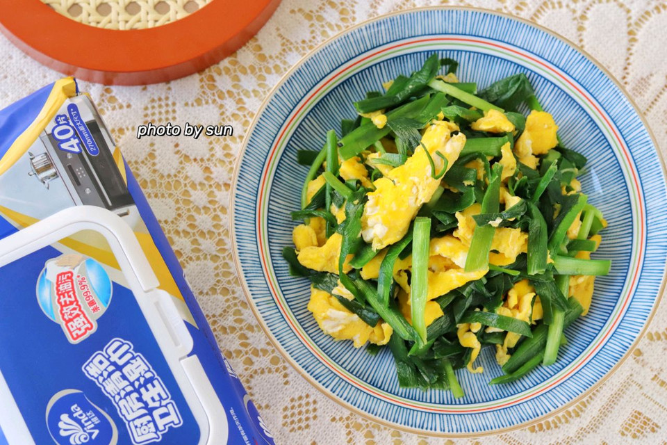

# 韭菜炒蛋

## 📋 基本資訊 / Recipe Overview
- **料理名稱**：韭菜炒蛋
- **原始標題**：韭菜炒蛋
- **素食流派 / Diet**：蛋素 Ovo-Vegetarian
- **料理分類 / Category**：家常蔬食 / 經典熱菜
- **難易度 / Difficulty**：切墩(初级)
- **烹飪時間 / Cooking Time**：10分钟左右
- **來源平台 / Source**：[豆果美食 · 素食專區](https://www.douguo.com/cookbook/3096567.html)

## 📝 料理故事與簡介 / Story & Introduction
> 下饭神器 超简单韭菜炒蛋 ～

## 🌿 食材及佐料清單 / Ingredients
- 韭菜：1把
- 鸡蛋：4个
- 盐：小半勺
- 橄榄油：少量
- 六月鲜8克轻盐原汁酱油：一小勺
- 料酒：一小勺

## 🍳 烹飪步驟 / Step-by-Step Cooking Steps
1. 按图中所示 准备好 酱油 鸡蛋 切好的韭菜
2. 锅子内再次喷入少量橄榄油
3. 倒入打散的鸡蛋
4. 快速炒熟铲出
5. 锅子内再次喷入少量橄榄油
6. 倒入切好的韭菜
7. 加入一小勺六月鲜8克轻盐原汁酱油 调味
8. 接着加入一勺料酒
9. 快速翻炒均匀
10. 倒入炒好的鸡蛋
11. 加入小半勺盐增加咸味
12. 翻炒混合均匀 出锅
13. 一个成品图图 超简单韭菜炒蛋就做好喽～

---
*食譜歸檔時間：2026-08-20 · 來源：豆果美食 (www.douguo.com)*