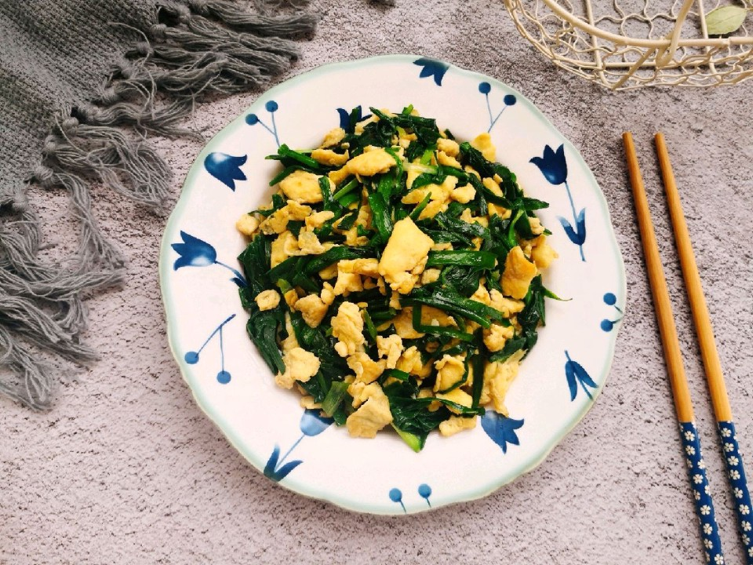

# 韭菜炒鸡蛋

## 📋 基本資訊 / Recipe Overview
- **料理名稱**：韭菜炒鸡蛋
- **原始標題**：韭菜炒鸡蛋
- **素食流派 / Diet**：蛋素 Ovo-Vegetarian
- **料理分類 / Category**：家常蔬食 / 經典熱菜
- **來源平台 / Source**：[豆果美食 · 素食專區](https://www.douguo.com/cookbook/2362965.html)

## 🌿 食材及佐料清單 / Ingredients
- 韭菜 160克
- 鸡蛋 3个
- 原味鲜调味料 2克
- 清水 少许
- 盐 适量

## 🍳 烹飪步驟 / Step-by-Step Cooking Steps
1. 韭菜摘去干枯发黄的叶子，清洗干净，长短切3厘米左右。
2. 鸡蛋磕入碗中打散。
3. 如果想让鸡蛋口感更加嫩滑可以稍微加点清水拌匀。
4. 热锅倒油烧至六成热时倒入鸡蛋，晃动锅底，让蛋液铺满整个锅底。
5. 稍微凝固时用锅铲快速铲成小块。
6. 倒入韭菜，快速翻炒1分钟左右。
7. 加入原味鲜调味料提鲜，再加入适量盐调味就可以关火起锅了，很简单有木有？
8. 上菜啦！

---
*食譜歸檔時間：2026-08-21 · 來源：豆果美食 (www.douguo.com)*