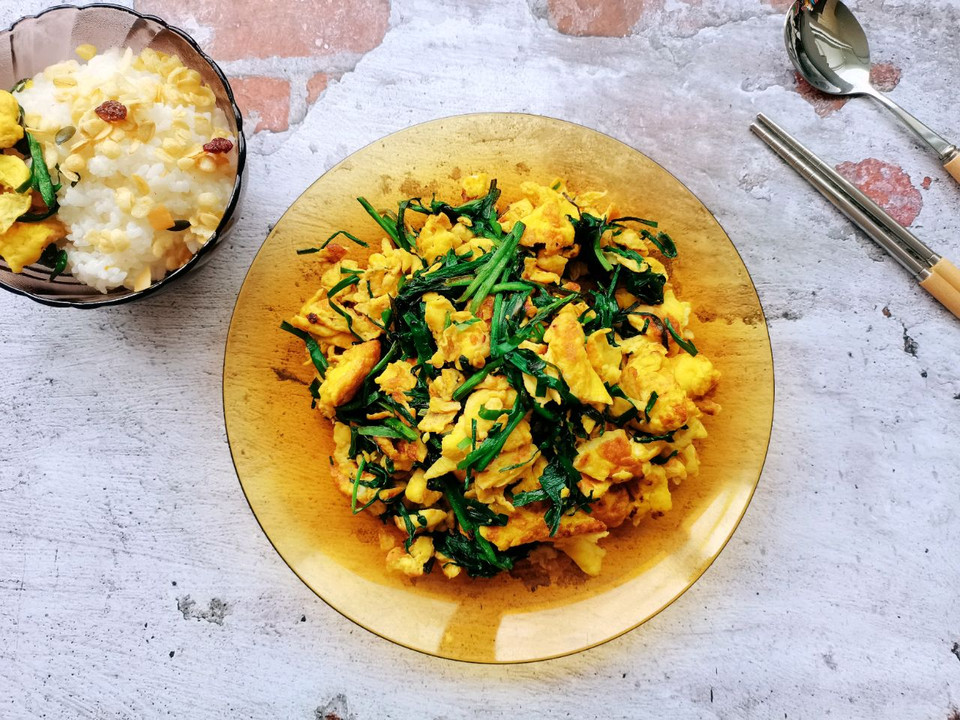

# 韭菜炒鸡蛋这样做，清清爽爽，不油不腻

## 📋 基本資訊 / Recipe Overview
- **料理名稱**：韭菜炒鸡蛋这样做，清清爽爽，不油不腻
- **原始標題**：韭菜炒鸡蛋这样做，清清爽爽，不油不腻#入秋滋补正当时#
- **素食流派 / Diet**：蛋素 Ovo-Vegetarian
- **料理分類 / Category**：家常蔬食 / 經典熱菜
- **來源平台 / Source**：[豆果美食 · 素食專區](https://www.douguo.com/cookbook/2981501.html)

## 🌿 食材及佐料清單 / Ingredients

## 🍳 烹飪步驟 / Step-by-Step Cooking Steps

---
*食譜歸檔時間：2026-08-20 · 來源：豆果美食 (www.douguo.com)*