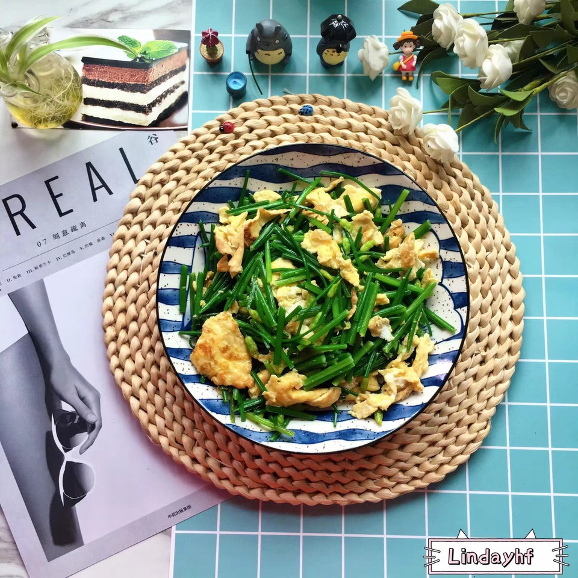

# 韭菜花炒鸡蛋

## 📋 基本資訊 / Recipe Overview
- **料理名稱**：韭菜花炒鸡蛋
- **原始標題**：韭菜花炒鸡蛋
- **素食流派 / Diet**：蛋素 Ovo-Vegetarian
- **料理分類 / Category**：家常蔬食 / 經典熱菜
- **來源平台 / Source**：[豆果美食 · 素食專區](https://www.douguo.com/cookbook/2324405.html)

## 🌿 食材及佐料清單 / Ingredients
- 韭菜花 200克
- 鸡蛋 2个
- 玉米油 适量
- 食用盐 适量

## 🍳 烹飪步驟 / Step-by-Step Cooking Steps
1. 韭菜花洗净切段，沥干水份备用
2. 两个鸡蛋去壳打在碗里
3. 锅里放适量玉米油烧开
4. 用筷子把鸡蛋打散
5. 油锅里倒入打散的鸡蛋，煎炸至表面金黄色
6. 把蛋饼翻面，打散开
7. 倒入切好的韭菜花翻炒均匀
8. 加入适量的食用盐
9. 用铲子翻炒，把盐分搅拌均匀
10. 加入少许水焖一下，大约三分钟左右
11. 等水分收干即可出锅食用啦！
12. 好漂亮美味的韭菜花炒鸡蛋，你喜欢吃吗？

## 💡 大廚美味秘訣 / Chef's Tips
- 因为鸡蛋很鲜美，所以没有用鸡精或蔬菜精调味

---
*食譜歸檔時間：2026-08-21 · 來源：豆果美食 (www.douguo.com)*