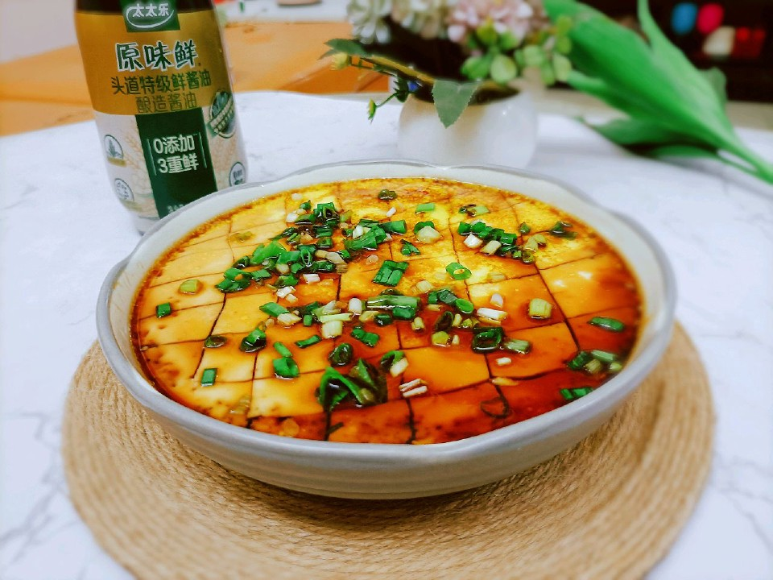

# 香嫩水蒸蛋

## 📋 基本資訊 / Recipe Overview
- **料理名稱**：香嫩水蒸蛋
- **原始標題**：香嫩水蒸蛋
- **素食流派 / Diet**：蛋素 Ovo-Vegetarian
- **料理分類 / Category**：家常蔬食 / 經典熱菜
- **來源平台 / Source**：[豆果美食 · 素食專區](https://www.douguo.com/cookbook/3100151.html)

## 🌿 食材及佐料清單 / Ingredients
- 鸡蛋 3个
- 水 1.5倍鸡蛋的分量
- 太太乐原味鲜酱油 少许
- 香油 少许
- 葱花 少许

## 🍳 烹飪步驟 / Step-by-Step Cooking Steps
1. 碗中打入三个鸡蛋，加点盐和油打散，打越久越好…
2. 接着加入1.5倍鸡蛋分量的水继续打均匀。
3. 放入蒸锅，盘子需要铺上保鲜膜或者盖子，再盖上锅盖，蒸大概20分钟！
4. 用勺子打鸡蛋表面，会弹就是熟了。
5. 用勺子划成格子型。
6. 撒上葱花。
7. 淋上太太乐原味鲜酱油即可出锅。
8. Q弹没味的蒸豆腐，一家人都爱吃。
9. 不用配饭，这样直接来吃可不错了。

---
*食譜歸檔時間：2026-08-21 · 來源：豆果美食 (www.douguo.com)*