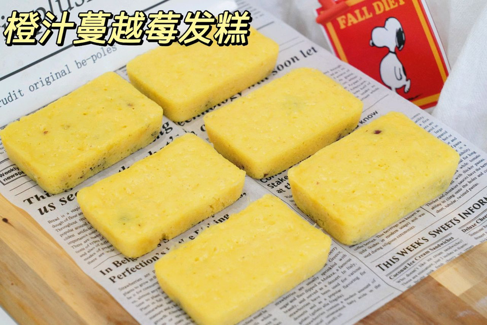

# 香橙蔓越莓发糕

## 📋 基本資訊 / Recipe Overview
- **料理名稱**：香橙蔓越莓发糕
- **原始標題**：香橙蔓越莓发糕
- **素食流派 / Diet**：蛋素 Ovo-Vegetarian
- **料理分類 / Category**：烘焙麵點 / 點心
- **來源平台 / Source**：[豆果美食 · 素食專區](https://www.douguo.com/cookbook/3232331.html)

## 🌿 食材及佐料清單 / Ingredients
- 鲜榨橙汁 170克
- 酵母 2克
- 水 8克
- 低粉 175克
- 糯米粉 40克
- 糖 20克
- 鸡蛋液 45克
- 金龙鱼玉米油 适量
- 蔓越莓干 50克

## 🍳 烹飪步驟 / Step-by-Step Cooking Steps
1. 两个赣南脐橙剥皮
2. 榨出170克鲜橙汁
3. 2克酵母用8克水化开
4. 大碗里过筛175克低筋面粉
5. 再筛入糯米粉
6. 加入糖和蛋液
7. 倒入酵母水
8. 最后倒入橙汁
9. 用刮刀翻拌均匀成细腻面糊
10. 倒进蔓越莓干，翻拌均匀
11. 把面糊挤进涂抹了金龙鱼玉米油的模具里
12. 面糊放进温暖湿润处发酵40分钟
13. 发酵结束，面糊放入蒸烤箱蒸20分钟
14. 蒸好闷5分钟再取出来
15. 金黄的橙汁蔓越莓发糕就完成啦！
16. 发糕超级松软，自带果香味

---
*食譜歸檔時間：2026-08-21 · 來源：豆果美食 (www.douguo.com)*