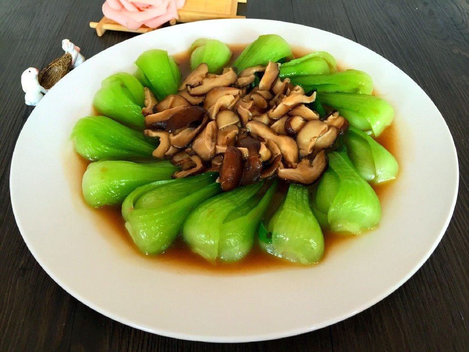

# 香菇油菜心

## 📋 基本資訊 / Recipe Overview
- **料理名稱**：香菇油菜心
- **原始標題**：香菇油菜心
- **素食流派 / Diet**：全素 Vegan
- **料理分類 / Category**：家常蔬食 / 經典熱菜
- **難易度 / Difficulty**：切墩(初级)
- **烹飪時間 / Cooking Time**：10分钟左右
- **來源平台 / Source**：[豆果美食 · 素食專區](https://www.douguo.com/cookbook/1341453.html)

## 📝 料理故事與簡介 / Story & Introduction
> 香菇油菜不仅味道美味营养更加丰富，作为大众菜品受到很多人的喜爱。大鱼大肉的年夜饭餐桌拥有它无疑是一道下饭佳肴。香菇是世界第二大食用菌，也是我国特产之一，在民间素有“山珍”之称。它是一种生长在木材上的真菌。味道鲜美，香气沁人，营养丰富。

## 🌿 食材及佐料清單 / Ingredients
- 油菜：8颗
- 香菇：6朵
- 葱：1颗
- 姜：1片
- 油：2勺
- 蒜：3瓣
- 蚝油：2勺
- 淀粉：1勺
- 水：半碗

## 🍳 烹飪步驟 / Step-by-Step Cooking Steps
1. 葱花，蒜片，姜丝，耗油，水淀粉（一勺淀粉小半碗水）备用，油菜洗净竖着切成两半
2. 香菇洗净去腿切成片或者打花刀（个人比较喜欢切片入味）
3. 锅中烧水，水热加入1匙盐，1匙油（这样煮出来的蔬菜颜色碧绿，营养不流失）加入油菜焯熟
4. 焯好的油菜过冷水后沥干摆于盘周
5. 周锅中热油，油热加入葱姜蒜蚝油淋入半碗水，水热加入香菇至香菇熟
6. 将香菇放在油菜中间
7. 锅中汤汁加入水淀粉转小火不停的搅拌，待汤汁浓稠淋在香菇油菜上，一道爽口开胃的香菇油菜就做好了，一起来试试吧。
8. 不同造型风格

## 💡 大廚美味秘訣 / Chef's Tips
- 1.香菇切片更容易入味，不切片打花刀比较美观根据个人喜好选择。2.油菜洗净切两半。3.煮油菜的时候加入油和盐可以更好的保持菜品的色泽和味道。4.酱油和蚝油均有咸味酌情添加盐

---
*食譜歸檔時間：2026-08-20 · 來源：豆果美食 (www.douguo.com)*